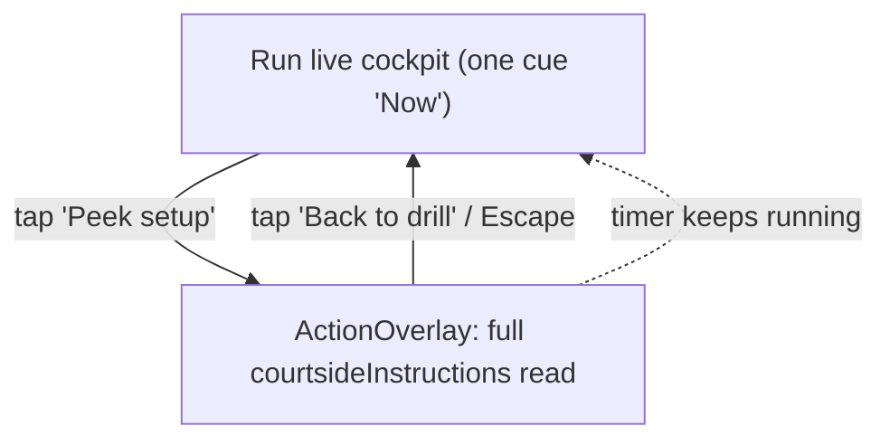

# feat: Run-flow beat contract — Stage 2 (safe recovery: one-touch "Peek setup")

**Origin:** `docs/brainstorms/2026-06-23-run-flow-beat-contract-requirements.md` (R8, R9, R10)
**Spec:** `docs/specs/run-flow-beat-contract.md` (Staged Rollout — Stage 2)
**Predecessor:** `docs/plans/2026-06-23-001-feat-run-flow-stage1-beat-contract-plan.md` (D164)
**Plan type:** feat · **Depth:** Standard
**Created:** 2026-06-23

## Summary

Stage 1 (`D164`) removed Run's inline full-instructions read so each athlete-facing field has one full-weight home — and deliberately stranded mid-rep setup re-reading on Run until this stage (the named Stage-1 trade). Stage 2 closes that gap with a **one-touch "Peek setup" recovery affordance**: a deliberate, large, positionally-stable button on Run that overlays the full `courtsideInstructions` read **while the block timer keeps running** (unlike Swap/Shorten, which pause), and dismisses back to the one-cue cockpit on tap. The read is *recovery, not a default re-read*: the full read keeps its single full-weight home on Transition (R8/R10) — the peek is a transient on-demand overlay, so no stage shows the full read in two beats at once. Run stays the one-cue DO-CONFIRM cockpit (R16); the peek is closed by default and adds nothing to the live face's glance load.

Founder steer (carried from Stage 1): **as minimal as possible**; the staging is what keeps the change safe.

> Note on the option label that requested this work ("preroll full read + one-touch peek setup"): per R8/R10 the **preroll full read is Stage 4, not Stage 2**. Adding a preroll read now would create a second full-weight home for `courtsideInstructions` and violate the single-home invariant. Stage 2 ships the peek only; the read stays homed on Transition.

## Problem Frame

After Stage 1, a winded athlete mid-rep on Run has only the one-cue "Now" line and (for segmented drills) the SegmentList. If they forget the setup, there is no on-Run way to re-read the full `courtsideInstructions` — the prose paragraph and the "Show full instructions" disclosure were both removed (R7b). Stage 1 justified the gap with courtside-copy rule 13 (the `skillFocus` + `successMetric.description` + `coachingCues[0]` triple is re-runnable without prose), but flagged the recovery affordance as the explicit Stage-2 follow-on (R9). This plan adds that affordance without re-homing the read (R8/R10) and without adding a second live cue at glare distance (R16).

## Key Technical Decisions

- **Peek renders `courtsideInstructions` directly via `GlossedText`, mirroring Transition exactly.** Transition renders the full read as `<GlossedText text={nextBlock.courtsideInstructions} />`; the peek renders `<GlossedText text={currentBlock.courtsideInstructions} />`. Same component, same term-gloss behavior, same prose — so "peek" and the Transition read are visibly the same instrument, just on-demand. This makes the peek the *recovery* of the exact read that was homed on Transition, not a new rendering.
- **Reuse `ActionOverlay` (bottom-sheet); do not build a new modal.** `ActionOverlay` already provides the portal, focus trap, Escape-to-dismiss, `aria-modal`, and inert-siblings treatment that the end-session sheet uses. The peek is `ActionOverlay` with `title = drillName`, a `GlossedText` child, and a full-width "Back to drill" dismiss button, at the canonical `bottom-sheet` placement. (`as minimal as possible`: no new primitive, no `BeatBody` framework — deferred per origin.)
- **The peek is RunScreen-local ephemeral UI state; it never touches the timer, persistence, or the controller.** A single `useState` `peekOpen` in `RunScreen`. Opening/closing calls no `timer.pause()/resume()` and no Dexie write — so the clock keeps running underneath (R9) and recovery is free of session-state side effects. This is the load-bearing contrast with Swap/Shorten/Pause/End, all of which call `timer.pause()` in `useRunController`.
- **Gate the affordance on `courtsideInstructions` presence, data-driven (not segmented-vs-non-segmented).** Show "Peek setup" only when `currentBlock.courtsideInstructions.trim()` is non-empty (there is a read to recover). Segmented drills whose moves are already on the live face but that also carry an overview paragraph still get the peek; segmented drills with no prose get nothing. No hardcoded segmentation branch.
- **Canonicalize the peek labels in the lexicon (R3/R4).** Add `peek: 'Peek setup'` and `peekClose: 'Back to drill'` to `RUN_FLOW_LABELS`; pin them in `runFlowLexicon.test.ts`. Neither collides with `SUNSET_RUN_FLOW_LABELS`, so the cross-surface guard stays green.
- **Remove the now-confirmed-dead `fullCue` / `fullInstructions` projections from `CurrentCueDisplay`.** Stage 1 retained them "for Stage 2's recovery peek," but the peek consumes `currentBlock.courtsideInstructions` directly (cleaner, matches Transition), and `RunScreen`'s "Show more cues" already reads `currentBlock.coachingCue` directly. Both fields are dead outputs read only by `currentCue.test.ts`. Delete them and their assertions (closes the Stage-1 residual "`currentCue.fullInstructions` is pinned but has no production reader").
- **Tests must be discriminating and mutation-checked.** The load-bearing assertions are: the read is **absent** from the live body by default (Stage-1 invariant preserved) and **present** only after tapping peek; and opening the peek does **not** pause the timer (no "Paused" indicator while open) — each must go red if the behavior regresses.
- **Land Stage 2 as an explicit decision row (`D165`).** The peek revises the Stage-1 must-not-render note for `courtsideInstructions` on Run (it now has an on-demand recovery home); record it, do not silently amend the spec.

## High-Level Technical Design

Run body + peek overlay (Stage 2 end state):

| Surface | Before (Stage 1) | After (Stage 2) |
|---|---|---|
| Run live body | title + "Now" + SegmentList + "Show more cues" | + a deliberate **"Peek setup"** trigger (when `courtsideInstructions` present) |
| Run peek overlay | — | `ActionOverlay` bottom-sheet: drill title + full `GlossedText` read + "Back to drill"; **timer keeps running** underneath; closed by default |
| Transition | full read homed here | unchanged (still the read's full-weight home, R8/R10) |

## Implementation Units

### U1. Lexicon: add `peek` / `peekClose` (R3, R4)

- **Goal:** Canonical single-sourced labels for the recovery affordance.
- **Files:**
  - `app/src/contracts/runFlowLexicon.ts` — add `peek: 'Peek setup'`, `peekClose: 'Back to drill'` to `RUN_FLOW_LABELS`; extend the docstring (Stage 2 recovery peek).
  - `app/src/contracts/__tests__/runFlowLexicon.test.ts` — pin both; re-assert active ∩ sunset = ∅.
- **Verification:** module test green; `tsc` clean.

### U2. Remove dead `fullCue` / `fullInstructions` from `CurrentCueDisplay`

- **Goal:** Drop dead projections now that the peek reads the source field directly.
- **Files:**
  - `app/src/screens/run/currentCue.ts` — remove `fullCue` / `fullInstructions` from the interface and the three return sites; drop the now-stale comment; keep `text` / `source`.
  - `app/src/screens/run/__tests__/currentCue.test.ts` — remove the `fullCue` / `fullInstructions` assertions; keep `text` / `source` coverage.
- **Dependencies:** none (independent of U3).
- **Verification:** `currentCue.test.ts` green; `tsc` clean; no other reader (`rg fullInstructions|fullCue app/src` returns only deleted sites).

### U3. RunScreen: "Peek setup" trigger + recovery overlay (R8, R9, R10, R16)

- **Goal:** A one-touch recovery peek that overlays the full read without pausing the timer.
- **Requirements:** R8, R9, R10, R16. Covers the Stage-2 half of AE3 (read recoverable on Run, still homed on Transition).
- **Files:**
  - `app/src/screens/RunScreen.tsx` — add `const [peekOpen, setPeekOpen] = useState(false)`; derive `hasSetupRead = currentBlock.courtsideInstructions.trim().length > 0`; render a deliberate full-width **"Peek setup"** trigger (outline, `min-h` thumb target) as the last body element when `hasSetupRead`; render the `ActionOverlay` (bottom-sheet) when `peekOpen`, containing the drill title, `<GlossedText text={currentBlock.courtsideInstructions} />`, and a full-width "Back to drill" button wired to `setPeekOpen(false)`. Import `ActionOverlay` and `GlossedText` from `components/ui`; import `RUN_FLOW_LABELS.peek` / `.peekClose`.
- **Approach:** Pure local UI state. No call to any `useRunController` handler. The overlay portals to `document.body`; `ActionOverlay` makes the cockpit inert/aria-hidden while open (timer logic keeps ticking — no `timer.pause()`), and restores focus on dismiss. The trigger sits in `ScreenShell.Body`, so for the non-segmented drills whose read was removed (the recovery case) the short body keeps it above the fold; for segmented drills it sits after the SegmentList.
- **Patterns to follow:** the end-session `ConfirmModal` (`placement="bottom-sheet"`, `max-w-[390px] rounded-focal`); Transition's `<GlossedText text={nextBlock.courtsideInstructions} />`.
- **Test scenarios (`app/src/screens/__tests__/RunScreen.peek-setup.test.tsx`, new):**
  - **(gating)** A running block with `courtsideInstructions` renders a "Peek setup" trigger; a block with empty `courtsideInstructions` renders none.
  - **(discriminating, Stage-1 invariant)** Before tapping peek, the full read text is **absent** from the document — must fail if the inline read returns to the live face.
  - **(discriminating)** Tapping "Peek setup" opens a `dialog` whose text contains the full read; tapping "Back to drill" (and, separately, Escape) closes it and the read is gone again.
  - **(discriminating, R9 timer)** With the block **running** (not paused), opening the peek does not render the "Paused" indicator and does not flip the timer aria-label to ", paused" — must fail if the peek is wired to `timer.pause()`.
- **Verification:** new test green; `RunScreen` renders one cue + peek trigger; no full read on the live face by default.

### U4. Reconcile existing run-face tests with the new trigger

- **Goal:** Keep the suite honest; no test passes for the wrong reason.
- **Files (read first, update only where the new trigger changes a census/absence assertion):**
  - `app/src/screens/__tests__/RunScreen.segmented-density.test.tsx`, `RunScreen.run-face.test.tsx`, `RunScreen.segments.test.tsx`, `RunScreen.coaching-cues-default.test.tsx`, `RunScreen.now-cue-fallback.test.tsx` — if any pins an exact body element set or asserts "no buttons in body," extend to allow the peek trigger; do not weaken read-absence assertions.
  - `app/src/screens/__tests__/runFlowLexicon.guard.test.tsx` — Run case stays green (peek closed by default ⇒ read still absent); optionally add a Stage-2 assertion that tapping the trigger surfaces the read (cross-surface recovery proof).
- **Verification:** full vitest suite green.

### U5. Docs + decision + catalog + rule sync (R1, R2)

- **Goal:** The beat contract reflects the shipped Stage 2; routing stays in sync.
- **Files:**
  - `docs/specs/run-flow-beat-contract.md` — mark Stage 2 **Shipped (D165)**; update the `courtsideInstructions` table row (demoted = Run "Peek setup" overlay, recovery only, timer keeps running; must-not-render = Run live cockpit body); refresh frontmatter `last_updated` + `decision_refs` (+`D165`) + summary.
  - `docs/decisions.md` — new `D165` row (Stage 2 recovery peek; revises the Stage-1 Run must-not-render note for `courtsideInstructions`; cite R8/R9/R10/R16).
  - `docs/status/current-state.md` — Snapshot (beat-contract Stage 2 shipped) + a Recent Shipped History entry; annotate the `D164` entry's "until Stage 2's recovery peek" as now shipped.
  - `docs/catalog.json` — register this plan (`run-flow-stage2-recovery-peek-plan-2026-06-23`).
  - `.cursor/rules/courtside-copy.mdc` — rule 12a: note Run can surface the full read on-demand via the "Peek setup" recovery overlay (timer keeps running); the live face stays one-cue.
- **Verification:** `bash scripts/validate-agent-docs.sh` passes; spec + rule + catalog + decision consistent.

## Scope Boundaries

### Deferred to follow-up

- **Stages 3-4** (felt continuity across seams; read-first collapse of the decide-step with the preroll full read) — gated on Stage-2 dogfood (origin staging).
- **Swap / shorten / skip / block-counter lexicon normalization** — contextual variants; a quick founder pass later (origin OQ).
- **Pinning the peek to the cockpit footer** — body placement is the minimal honest version; if dogfood shows the trigger is hard to reach mid-rep, a follow-up can pin it to the always-visible cockpit.

### Outside this pass's identity

- A `BeatBody` layout primitive (doc + light lint is enough for one user).
- Backdrop-tap-to-dismiss on the overlay (Escape + the "Back to drill" button are sufficient; `ActionOverlay` has no backdrop-click seam and adding one risks the focus contract).
- `externalFocusCue` as a typed cue field (a separate M002.2 follow-on).

## Risks & Dependencies

- **Read duplication (R10).** Mitigation: the read is rendered in exactly one place at a time — Transition (full-weight) or the transient peek overlay (recovery); never both on screen simultaneously, and the live cockpit body never carries it. The discriminating "absent by default" test guards this.
- **`ActionOverlay` inert/focus in jsdom.** The end-session sheet already exercises `ActionOverlay` in tests, so the portal + inert path is proven in the test env. Use `getByRole('dialog')` and text queries (which see aria-hidden text) for assertions.
- **Timer-keeps-running is a negative property.** Mitigation: assert the absence of the "Paused" indicator / ", paused" aria while the peek is open, with the block seeded **running** — discriminating against a `timer.pause()` regression.
- **Invariants to hold (R16-R18):** one-cue cockpit (rule 12a) unchanged; no raw rung numbers (`D157`); descriptive copy (`D154`); shared header / no Back / no End-session on the live face (`D153`); ≤45-word read + no em-dashes (rules 14/4) — the peek reuses the same `courtsideInstructions` strings that already satisfy these. Keep `RunFlowHeader.test.tsx` and `RunScreen.preroll-hint.test.tsx` green.

## Sources & Research

- Origin: `docs/brainstorms/2026-06-23-run-flow-beat-contract-requirements.md` (R8/R9/R10, AE3, staged rollout).
- Spec: `docs/specs/run-flow-beat-contract.md` (beat table, Staged Rollout).
- Predecessor: `docs/plans/2026-06-23-001-feat-run-flow-stage1-beat-contract-plan.md` (Stage 1 residual: the dead `fullInstructions` field; the stranded mid-rep recovery trade).
- Code: `app/src/screens/RunScreen.tsx`, `app/src/screens/run/useRunController.ts`, `app/src/screens/run/currentCue.ts`, `app/src/components/ui/ActionOverlay.tsx`, `app/src/components/patterns/ConfirmModal.tsx`, `app/src/components/ui/GlossedText.tsx`, `app/src/components/BlockTimer.tsx`, `app/src/screens/TransitionScreen.tsx`.
- Canon: `.cursor/rules/courtside-copy.mdc` (rules 12a/13/14/4), `docs/decisions.md` (D153, D154, D157, D163, D164).
- Test commands (`app/`): `npm test`, `npm run typecheck`, `npm run lint`, `npm run typography:guardrails:check`, `npm run architecture:check`; docs: `bash scripts/validate-agent-docs.sh`.
