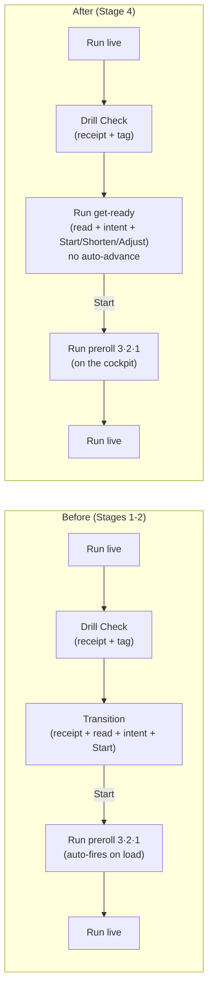
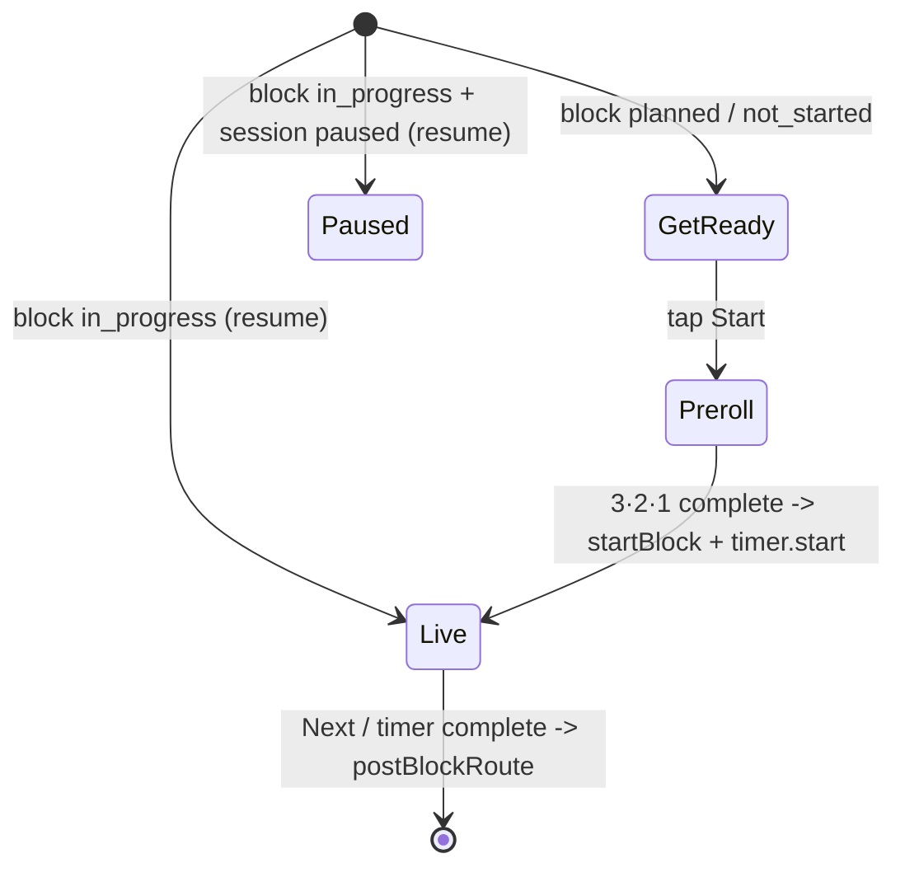

# feat: Run-flow beat contract — Stage 3 (felt continuity) + Stage 4 (read-first collapse)

**Origin:** `docs/brainstorms/2026-06-23-run-flow-beat-contract-requirements.md` (R11–R18; F3; AE3, AE4)
**Spec:** `docs/specs/run-flow-beat-contract.md` (Staged Rollout — Stages 3, 4)
**Predecessors:** `docs/plans/2026-06-23-001-feat-run-flow-stage1-beat-contract-plan.md` (D164) · `docs/plans/2026-06-23-002-feat-run-flow-stage2-recovery-peek-plan.md` (D165)
**Plan type:** feat · **Depth:** Deep
**Created:** 2026-06-23
**Proposed decisions:** `D166` (Stage 3 felt continuity), `D167` (Stage 4 read-first collapse — a `D163`/`D137` revisit)

## Summary

Finish the run-flow beat contract by making the sequence read as **one instrument** and then collapsing the now-redundant decide screen. **Stage 3 (felt continuity)** renders the just-finished receipt exactly once per drill (R12) and pins continuity-by-stillness across the beat seams — identical title/header position and typography, no animation, reduced-motion safe (R11). **Stage 4 (read-first collapse)** removes the forced Transition route: Drill Check flows straight into a read-first **get-ready** on Run that carries the full setup read, the block-opening intent, and a single dominant **Start** (with **Shorten** at top-level CTA width and swap/skip behind a cancelable **Adjust**). The get-ready **does not auto-advance** — a resting athlete is never rushed — and the 3·2·1 count-in runs only after Start, on the cockpit, never on the read surface (R13/R14). The block-opening intent keeps a home on the first drill's get-ready (R15).

Founder steer (carried from Stages 1–2): **as minimal as possible**; the staging is what keeps an ambitious change safe. This pass executes both remaining stages in one pipeline at the founder's explicit request; the collapse is built **reversibly** (TransitionScreen and its route are retained as a compatibility redirect, not deleted) so the dogfood-gate (R14) becomes a post-ship founder check rather than a between-stage hold.

> Note on staging compression: the origin sequences Stage 4 *after* a Stage-3 dogfood window (R14). The founder invoked both stages together, so this plan keeps the decide-step **behavior** (read-first, no auto-advance, count-in only after Start) — which the current Transition→Run flow already satisfies — and makes the **route collapse** reversible at the routing layer. If dogfood surfaces a regression, reverting `postBlockRoute` + the Drill Check Continue target restores the Transition spine without touching the read's home.

---

## Problem Frame

After Stages 1–2, each athlete-facing field has one full-weight home and Run can recover the full read on demand. Two structural seams remain:

1. **The receipt renders twice.** For a count-eligible main/pressure block, the just-finished receipt (`JustFinishedPill`) renders on **both** Drill Check (`status="completed"`) and Transition (`presentation="line"`) — the same drill, two beats apart. R12 says once per drill: on Drill Check where it shows, on the bypass beat only when Drill Check was skipped (warmup/technique/wrap/skipped).
2. **Transition is a near-empty hop.** Once the cue is cut (Stage 1) and the receipt is deduped (R12), a mid-block Transition carries only the next title/eyebrow/duration, the full read, and the decide footer — and the decide is "~always Start" (founder-confirmed). It is a forced screen one tap before Run that the athlete reads, taps through, and re-reads nothing. The current flow already reads the setup, waits for Start, and only then fires the count-in on Run — Stage 4 just **collapses that two-screen choreography into one** so the read sits where the action is.

The founder's original complaint was "WAY too much text and fonts ... super messy"; Stage 1 removed the duplicated text, and Stages 3–4 remove the duplicated *screens* so the flow stops feeling like three page-loads between drills.

---

## Key Technical Decisions

- **R12 dedup keys on the shared Drill-Check eligibility resolver, not a new flag.** `resolveDrillCheckCaptureEligibility({ plan, execution, currentBlockIndex })` already decides whether Drill Check renders for the just-finished block; a `status === 'bypass'` result means Drill Check redirected and did **not** show the receipt. The receipt's "bypass home" (Transition pre-collapse, get-ready post-collapse) renders `JustFinishedPill` **only** when that resolver reports bypass for the previous block. One predicate, two callers, no duplicated policy.
- **R11 is continuity-by-stillness, not animation.** The title and header already share typography (`text-xl font-semibold tracking-tight`) and the `RunFlowHeader` component across Drill Check / Transition / Run. Stage 3 makes that *intentional and protected*: a guard test pins identical title/header treatment across the beats, and the default + reduced-motion paths are the same static layout. No motion is added; "continuity never delays the timer" is preserved because nothing new runs before the count-in.
- **Stage 4 reuses the existing preroll; it only gates *when* it fires.** Today `useRunController` auto-fires `startWithPreroll` on load for a `planned`/`not_started` block. Stage 4 introduces a **get-ready** state: for a not-yet-started block, render the read-first get-ready instead of auto-firing; `handleStart` fires the same `startWithPreroll` (the same 3·2·1 → `startBlock` → `timer.start`). In-progress/paused recovery paths are untouched. This is the smallest change that satisfies "count-in only after Start" (R13).
- **The get-ready becomes the READ-DO surface; the M002.2 technique-how home migrates onto it (resolves the flagged reconciliation).** The origin flags that Stage 4 collapses Transition — the surface M002.2 chose as its READ-DO technique-how home. Resolution: the get-ready *is* the new READ-DO beat. The full read and the block-opening intent (R15) move from Transition onto the get-ready, so READ-DO depth is preserved, not lost. The deferred M002.2 work (externalFocusCue, Run/Drill-Check depth, less-offer Review) is unaffected by *where* the READ-DO home lives and can proceed in parallel against the get-ready. Sequencing note: this density pass and the M002.2 spine are independent; the get-ready is the post-collapse READ-DO home either order.
- **Collapse is reversible at the routing layer (D137 "compatibility at the gate").** `postBlockRoute` and Drill Check `handleContinue` retarget Run instead of Transition; `/run/transition` stays in `routePaths` but TransitionScreen short-circuits to `/run` (the get-ready) for any stale deep link, mirroring the D137 retired-route pattern. TransitionScreen + `useTransitionController` are **not deleted** this pass, so rollback is a two-line routing revert and the read never has to migrate back.
- **The block-opening intent home moves with the read (R15).** `resolveBlockOpeningIntent` (already pure, already powering Transition) is wired into `useRunController` so the get-ready shows the intent on a focus run's opening block and recedes after. The `set → pass → set` interleave regression carries to the new home.
- **Decide controls follow R13's hierarchy exactly.** Get-ready footer: **Start** (primary, dominant) → **Shorten** (top-level, CTA-width outline — the tired-athlete escape, never buried) → **Adjust** (a cancelable disclosure that reveals Swap + Skip). Adds one lexicon label `adjust: 'Adjust'`; reuses `start` / `shorten` / `swap` / `skip`.
- **No schema, no data-model change.** Stage 3–4 are render + routing + controller-state changes only. Dexie stays v7; no new persisted field; diagnostics untouched.
- **Land as explicit decisions (`D166`, `D167`).** Stage 4 revisits D163 (intent placement) and D137 (pre-run spine); record both rather than silently amending the spec.

---

## High-Level Technical Design

**Flow change (forced spine):**

**Receipt home (R12), per block:**

| Just-finished block kind | Drill Check shows? | Receipt home |
|---|---|---|
| count-eligible (main / pressure) | yes | **Drill Check** only |
| difficulty-only eligible | yes | **Drill Check** only |
| bypassed (warmup / technique / wrap / skipped) | no (redirects) | **bypass beat** (Transition pre-collapse → get-ready post-collapse) only |

**Run states (Stage 4), within `useRunController`:**

> Directional guidance, not implementation specification. The get-ready is a render branch gated on a controller-exposed `isGetReady`; recovery (in-progress/paused) paths are unchanged from today.

---

## Implementation Units

### U1. Receipt-dedup predicate + Transition suppression (R12)

- **Goal:** The just-finished receipt renders once per drill; the bypass beat shows it only when Drill Check was bypassed.
- **Requirements:** R12. Covers F1/F2 receipt hygiene.
- **Dependencies:** none.
- **Files:**
  - `app/src/domain/capture.ts` (or the module exporting `resolveDrillCheckCaptureEligibility`) — add a thin pure predicate, e.g. `drillCheckBypassedForPreviousBlock(plan, execution, currentBlockIndex): boolean`, returning `true` when the resolver's status is `bypass` (Drill Check did not show the receipt for the just-finished block). Reuse the existing resolver; do not reimplement eligibility.
  - `app/src/screens/transition/useTransitionController.ts` — expose `showJustFinishedReceipt` derived from the predicate (`true` only when the previous block bypassed Drill Check).
  - `app/src/screens/TransitionScreen.tsx` — render `JustFinishedPill` only when `showJustFinishedReceipt`.
  - Test: `app/src/screens/__tests__/TransitionScreen.quietReceipt.test.tsx` (extend) + a predicate unit test alongside the resolver's existing tests.
- **Approach:** The resolver is already called on Drill Check with the same `currentBlockIndex`; calling the predicate from Transition with Transition's `currentBlockIndex` evaluates the *same* just-finished block, so the two beats agree by construction. Skipped blocks bypass Drill Check ⇒ predicate `true` ⇒ Transition shows the skipped receipt (unchanged behavior for skips).
- **Patterns to follow:** existing `resolveDrillCheckCaptureEligibility` consumers in `useDrillCheckController`.
- **Test scenarios:**
  - Covers R12. Previous block was count-eligible (Drill Check showed receipt) → Transition renders **no** `JustFinishedPill`.
  - Previous block was warmup/technique/wrap (Drill Check bypassed) → Transition renders the `JustFinishedPill` (completed).
  - Previous block was **skipped** → Transition renders the `JustFinishedPill` with skipped status.
  - Predicate unit: `bypass` status → `true`; `eligible_counts` / `eligible_difficulty_only` → `false`.
- **Verification:** Transition shows the receipt only on bypass; Drill Check unchanged; suite green.

### U2. Continuity-by-stillness guard (R11)

- **Goal:** Lock identical title/header treatment across the beat seams; no animation; reduced-motion = same static layout.
- **Requirements:** R11.
- **Dependencies:** none.
- **Files:**
  - `app/src/screens/__tests__/RunFlowContinuity.stillness.test.tsx` (new) — render Drill Check, Transition, and Run (get-ready + live) for the same drill and assert the drill title uses identical typography classes and the shared `RunFlowHeader` in each; assert no transition/animation utility classes are introduced on the title/header across the seam.
  - `app/src/components/patterns/RunFlowHeader.tsx` and the three screens — only if the guard reveals drift; otherwise no source change (the work is making the existing stillness intentional + protected).
- **Approach:** Continuity-by-stillness means the seam is invisible because positions/typography match, not because something animates. The guard is the durable artifact; any source change is limited to removing an introduced animation or aligning a drifted class. Continuity never delays the timer — no pre-count-in motion is added.
- **Patterns to follow:** existing `RunFlowHeader` shared-header usage; the `Test expectation` discipline in the Stage-1/2 guard tests.
- **Test scenarios:**
  - Covers R11. Drill title renders with the same class set on Drill Check, Transition, and Run.
  - The `RunFlowHeader` is the header element on all three beats (shared component, not re-instantiated per route).
  - No `animate-*` / `transition-*` motion class appears on the title or header across the seam (stillness, reduced-motion safe).
- **Verification:** guard green; visual dogfood (LFG browser step) confirms no perceived jump Drill Check → get-ready → live.

### U3. Run get-ready controller state — gate the preroll behind Start (R13)

- **Goal:** A not-yet-started block shows a read-first get-ready instead of auto-firing the count-in.
- **Requirements:** R13. Enables F3/AE4.
- **Dependencies:** none (pure controller change; UI lands in U4).
- **Files:**
  - `app/src/screens/run/useRunController.ts` — replace the `queueMicrotask(startWithPreroll)` auto-fire (for `planned`/`not_started`) with an `isGetReady` state set `true`; add `handleStart()` that fires `startWithPreroll()` and clears `isGetReady`; add a get-ready `handleStartShortened()` (sets shortened `activeDuration` then starts) so Shorten works without the old Transition nav-state. Keep the in-progress/paused recovery branches **unchanged**. Expose `isGetReady`, `handleStart`, `rungIntentLine` (see U6), and the existing swap/skip/shorten handlers.
  - Test: `app/src/screens/run/__tests__/useRunController.test.tsx` (extend).
- **Approach:** The get-ready is the pre-start view of the *same* block the controller already loads; no new data fetch. `handleStart` is the only new path to the preroll. `shortened` stops coming from `location.state` (no Transition to set it) and becomes a get-ready action.
- **Test scenarios:**
  - Covers R13. A freshly loaded `planned` block exposes `isGetReady === true` and does **not** start the preroll (no `startBlock`/`timer.start` until `handleStart`).
  - `handleStart()` fires the preroll exactly once; after completion the block starts (`startBlock` + `timer.start`).
  - An `in_progress` block (resume) does **not** enter get-ready (recovery path unchanged).
  - Get-ready Shorten then Start runs the block at the shortened duration.
- **Verification:** controller test green; no auto-advance for fresh blocks; resume unaffected.

### U4. Run get-ready UI — read-first body + Start/Shorten/Adjust (R13, R15)

- **Goal:** Render the read-first get-ready: full read + block-opening intent + the R13 control hierarchy; no auto-advance.
- **Requirements:** R13, R15. Covers AE4.
- **Dependencies:** U3 (controller `isGetReady`/`handleStart`), U6 (intent line), U7 (`adjust` label).
- **Files:**
  - `app/src/screens/RunScreen.tsx` — when `isGetReady`, render a get-ready branch: `ScreenShell.Body` with the drill title (same treatment as live, R11), the block-opening `rungIntentLine` (when present), and the full `<GlossedText text={currentBlock.courtsideInstructions} />` (READ-DO home migrated from Transition); `ScreenShell.Footer` with **Start** (primary, dominant) → **Shorten** (outline, CTA width) → **Adjust** (cancelable disclosure revealing **Swap** when `hasAlternates` + **Skip** when `!currentBlock.required`). When not `isGetReady`, the existing preroll/live cockpit renders unchanged (including the Stage-2 "Peek setup", which stays for mid-rep recovery).
  - Test: `app/src/screens/__tests__/RunScreen.get-ready.test.tsx` (new).
- **Approach:** Mirror Transition's footer hierarchy and `GlossedText` read so the get-ready *is* the Transition content, now on Run. The count-in digit and live timer keep the footer once Start fires (no change). Reuse `ActionOverlay`/disclosure conventions for Adjust (cancelable per R13).
- **Patterns to follow:** `TransitionScreen.tsx` footer (Start / Shorten / Swap / Skip), `RunScreen` Stage-2 body, `RunFlowHeader`.
- **Test scenarios:**
  - Covers R13/AE4. Get-ready renders the full read + a single dominant Start; doing nothing does **not** advance (no count-in digit, no `startBlock`).
  - Tapping Start shows the 3·2·1 count-in on the cockpit, then the live timer (count-in only after Start; never on the read surface).
  - Shorten is a top-level CTA-width control (not inside Adjust); Adjust reveals Swap (when alternates) and Skip (when not required) and is cancelable.
  - Covers R15. On a focus run's opening block the intent line renders on the get-ready; on a mid-run block it does not.
  - The full read is present on the get-ready (READ-DO home) and the live cockpit body still does **not** render it (Stage-1 invariant; recover via Peek setup).
- **Verification:** new test green; get-ready matches AE4; live face unchanged.

### U5. Route collapse — Drill Check → Run get-ready; Transition becomes a redirect (R14)

- **Goal:** Remove the forced Transition hop; preserve Drill Check and stale-link safety; keep it reversible.
- **Requirements:** R14. Enables F3.
- **Dependencies:** U3, U4 (get-ready must exist before routing to it).
- **Files:**
  - `app/src/domain/runFlow/postBlockRoute.ts` — the non-last target is already Drill Check; confirm Run → Drill Check stays unchanged (the collapse is downstream of Drill Check).
  - `app/src/screens/drillCheck/useDrillCheckController.ts` — `handleContinue` and the bypass effect navigate to `routes.run(...)` (the get-ready) instead of `routes.transition(...)`.
  - `app/src/screens/transition/useTransitionController.ts` (or `TransitionScreen.tsx`) — add a redirect: any landing on `/run/transition` replaces to `routes.run(...)` (compatibility, D137 pattern). Do not delete the module.
  - `app/src/routes.ts` — keep `transition` in `routePaths`/`routes` (compatibility); add a comment marking it a redirect-only legacy route post-D167.
  - Tests: `app/src/screens/__tests__/DrillCheckScreen.perDrillCapture.test.tsx` (Continue now lands on `/run`), `app/src/domain/runFlow/__tests__/postBlockRoute.test.ts` (unchanged Drill Check target), a new `app/src/screens/__tests__/TransitionScreen.redirect.test.tsx` (stale `/run/transition` → `/run`).
- **Approach:** Exactly the D137 "compatibility at the gate, not in the spine" shape: the spine stops routing *to* Transition, but the route survives as a redirect so PWA cold-starts / bookmarks / browser-back never hit a dead screen. Reversal = restore the two `routes.transition` targets.
- **Patterns to follow:** `docs/solutions/architecture-patterns/d137-canonical-pre-run-spine-setup-safety-2026-05-07.md`; `FirstOpenGate` retired-route handling.
- **Test scenarios:**
  - Covers R14/F3. Completing Drill Check navigates to `/run` (get-ready), not `/run/transition`.
  - A bypassed (warmup) block: Drill Check redirects forward to `/run` (get-ready), not Transition.
  - Stale `/run/transition?id=…` deep link replaces to `/run?id=…`.
  - Last block path is unchanged (`postBlockRoute` → `/review`).
- **Verification:** forced spine no longer mounts Transition; stale links redirect; reversible.

### U6. Block-opening intent home on the get-ready (R15)

- **Goal:** The block-opening intent keeps a home after collapse, on the first drill's get-ready.
- **Requirements:** R15. Honors D163/D157.
- **Dependencies:** U3 (controller), U4 (UI consumes the line).
- **Files:**
  - `app/src/screens/run/useRunController.ts` — derive `rungIntentLine = resolveBlockOpeningIntent(plan?.blocks, currentBlockIndex, plan?.playerCount ?? 1)` and expose it (mirrors `useTransitionController`).
  - Test: `app/src/screens/run/__tests__/useRunController.test.tsx` (extend) — carry the `set → pass → set` interleave regression to the new home (first-appearance keying, not adjacent compare).
- **Approach:** Pure reuse of the existing `resolveBlockOpeningIntent` helper; the get-ready is the new opening surface. No raw rung numbers (D157); descriptive only (D154).
- **Test scenarios:**
  - Covers R15/AE1. Intent renders on a focus run's opening get-ready; recedes on subsequent get-readys in the run.
  - `set → pass → set` interleave: the re-entered `set` block after a `pass` support slot does **not** re-show the intent (prefix-scan first-appearance, per `docs/solutions/logic-errors/interleaved-sequence-first-appearance-keying.md`).
- **Verification:** intent home preserved post-collapse; interleave regression green.

### U7. Lexicon `adjust` + docs / decision / spec / catalog / rule sync (R3, R4)

- **Goal:** Single-sourced label; canon reflects shipped Stages 3–4.
- **Requirements:** R3, R4.
- **Dependencies:** U1–U6 (describe the shipped end state).
- **Files:**
  - `app/src/contracts/runFlowLexicon.ts` + `app/src/contracts/__tests__/runFlowLexicon.test.ts` — add `adjust: 'Adjust'`; pin it; re-assert active ∩ sunset = ∅.
  - `docs/specs/run-flow-beat-contract.md` — mark Stages 3–4 **Shipped (D166 / D167)**; update the beat table (receipt = single home per R12; full read + intent full-weight home = get-ready post-collapse, Transition = legacy redirect); refresh frontmatter (`last_updated`, `decision_refs` +`D166` +`D167`, summary).
  - `docs/decisions.md` — add `D166` (Stage 3 felt continuity) and `D167` (Stage 4 read-first collapse; revisits D163 intent placement + D137 spine; cite R11–R15, the reversibility + M002.2-home-migration KTDs).
  - `docs/status/current-state.md` — Snapshot + Recent Shipped History entries; note the run-flow beat contract is complete through Stage 4.
  - `docs/catalog.json` — register this plan.
  - `.cursor/rules/courtside-copy.mdc` — rule 12a / pre-run spine note: the READ-DO home is the Run get-ready post-collapse; Transition is a redirect-only legacy route; receipt renders once per drill.
  - `CONCEPTS.md` — add `Get-ready` (the read-first pre-start beat on Run that carries the setup read + block-opening intent + Start) if missing.
- **Verification:** `bash scripts/validate-agent-docs.sh` passes; lexicon test green; spec/rule/catalog/decisions consistent.

---

## Scope Boundaries

### Deferred to follow-up

- **Deleting TransitionScreen / `useTransitionController`** — retained this pass as the reversible redirect; delete only after the dogfood window confirms no regression (a later cleanup, D137-style "delete dead verticals together").
- **`externalFocusCue` typed cue field + Run/Drill-Check technique-how depth + less-offer Review** — the deferred M002.2 spine; targets the get-ready as the READ-DO home but is out of this pass.
- **Decision-control de-duplication** (swap/shorten/skip canonical strings) — a later clause of the same contract; this pass adds only `adjust`.
- **A `BeatBody` enforcement primitive / peripheral phase-signature system** — doc + light lint is enough for one user.

### Outside this pass's identity

- One cue per focus block (breaks the rule-13 triple readability contract).
- Inferred/auto-selected difficulty tags (corrupts D130 sole-evidence honesty).
- A propped-up / across-court phone redesign.
- Any animation-based continuity beyond what stillness needs (R11 default is stillness; animation is added only if stillness proves insufficient — not in this pass).

---

## Risks & Dependencies

- **Staging compression (R14 dogfood gate).** Building Stage 4 before a Stage-3 dogfood window departs from the origin's between-stage gate. Mitigation: reversibility at the routing layer (TransitionScreen + route retained as redirect; revert = restore two `routes.transition` targets), plus the LFG browser dogfood (step 6) and the founder's post-ship check as the regression gate. Documented as an accepted, founder-requested deviation in `D167`.
- **D137 pre-run-spine intersection.** Collapse touches the canonical spine and `routePaths`. Mitigation: follow the D137 compatibility-at-the-gate pattern exactly; keep a test proving stale `/run/transition` redirects (not a dead mount).
- **M002.2 READ-DO home.** Stage 4 moves the technique-how home off Transition. Mitigation: the get-ready *is* the new READ-DO surface (read + intent migrate intact); the deferred M002.2 depth targets it. Recorded as a KTD + sequencing note.
- **Get-ready Shorten without Transition nav-state.** `shortened` no longer arrives via `location.state`. Mitigation: get-ready owns a local shorten action applied before `startBlock` (U3); covered by a controller test.
- **Recovery/resume regressions.** The get-ready must not intercept in-progress/paused blocks. Mitigation: only the `planned`/`not_started` branch changes; resume branches untouched; explicit resume test (U3).
- **Invariants (R16–R18).** One-cue live cockpit (rule 12a) unchanged; the get-ready is READ-DO (not a second live cue at glare distance); no raw rung numbers (D157); descriptive copy (D154); shared header / no Back / no End-session on the live face (D153); ≤45-word read + no em-dashes (rules 14/4) — the get-ready reuses the same `courtsideInstructions` + intent strings. Keep `RunScreen.preroll-hint.test.tsx`, `RunScreen.run-face.test.tsx`, and `RunScreen.peek-setup.test.tsx` green.

---

## Sources & Research

- Origin: `docs/brainstorms/2026-06-23-run-flow-beat-contract-requirements.md` (R11–R18, F1–F3, AE1/AE3/AE4, staged rollout, the M002.2 reconciliation question).
- Spec: `docs/specs/run-flow-beat-contract.md` (beat table, block-opening rule, Staged Rollout).
- Predecessors: `docs/plans/2026-06-23-001-…-stage1-…` (D164), `docs/plans/2026-06-23-002-…-stage2-…` (D165).
- Code: `app/src/screens/RunScreen.tsx`, `app/src/screens/TransitionScreen.tsx`, `app/src/screens/DrillCheckScreen.tsx`, `app/src/screens/run/useRunController.ts`, `app/src/screens/transition/useTransitionController.ts`, `app/src/screens/drillCheck/useDrillCheckController.ts`, `app/src/domain/runFlow/postBlockRoute.ts`, `app/src/hooks/usePreroll.ts`, `app/src/domain/drillMetadata.ts` (`resolveBlockOpeningIntent`), `app/src/domain/capture.ts` (`resolveDrillCheckCaptureEligibility`), `app/src/routes.ts`, `app/src/components/patterns/RunFlowHeader.tsx`.
- Canon / learnings: `.cursor/rules/courtside-copy.mdc` (rules 12a/13/14/4), `docs/decisions.md` (D153, D154, D157, D163, D164, D165, D137), `docs/solutions/architecture-patterns/d137-canonical-pre-run-spine-setup-safety-2026-05-07.md`, `docs/solutions/logic-errors/interleaved-sequence-first-appearance-keying.md`, `CONCEPTS.md`.
- Verification commands (`app/`): `npm test`, `npm run typecheck`, `npm run lint`, `npm run typography:guardrails:check`, `npm run architecture:check`; docs: `bash scripts/validate-agent-docs.sh`.
