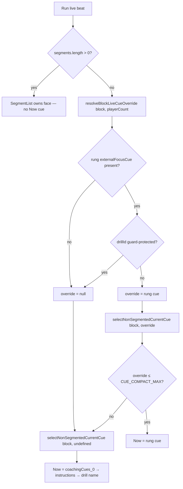

# feat: M002.2 rung-aware live cue — floor + trunk

**Origin:** `docs/brainstorms/2026-06-30-m002-2-rung-aware-coaching-arc-requirements.md`
**Plan type:** feat · **Depth:** Standard
**Created:** 2026-06-30

## Summary

Make the live "Now" cue rung-aware. A new pure domain helper resolves the rung's authored `externalFocusCue` for a block and feeds it through the existing one-cue selector as a preferred cue; the selector's `CUE_COMPACT_MAX` gate and fallback chain stay single-sourced. The swap is guarded by a manual drill-id registry so a load-bearing drill cue (e.g. `d07`'s gaze cue) is never overwritten, and the "Drill details" overlay is re-derived so the displaced cue can't reappear one tap away. A warn-level catalog "floor" ships first to flag any unfit live-eligible cue before the trunk promotes it. Presentational only — no Dexie/schema/route/assembly change.

## Problem Frame

`D154` shipped rung-steered assembly and `D163` rendered the rung `intent` (why-before) on the Run get-ready beat, but the rung's `externalFocusCue` — the authored, validated, per-rung prompt that "makes the step real" — renders nowhere. During the rep the athlete sees only the drill's generic `coachingCues[0]`, identical at every rung. The 2026-06-22 slice deliberately held `externalFocusCue` back because rendering it *alongside* `coachingCues[0]` would be a duplicate external-focus read at glare distance (courtside-copy rule 12a: one cue at arm's length). This slice resolves that by **substituting**, not adding: on a ladder-bearing block the rung cue *becomes* the one live cue. The new risk substitution introduces — `externalFocusCue` is authored per `(focus, rung)` and shared across every drill on a rung, so a blanket swap can erase a drill's own load-bearing cue — is contained by the guard.

## Requirements

Carried from the origin (`docs/brainstorms/2026-06-30-m002-2-rung-aware-coaching-arc-requirements.md`).

### Trunk — rung-aware live cue

- R1. On Run live, when the block resolves to a rung carrying an authored `externalFocusCue` and the guard permits, that cue is the single "Now" cue.
- R2. Guarded substitution: the rung cue replaces `coachingCues[0]` *unless* the drill's own cue is load-bearing (gaze/perceptual per rule 12c, or safety per rule 12b), in which case the drill cue stays live. Exactly one live cue renders.
- R3. Resolution is a pure domain helper (block → live-cue string), keyed on the block's primary skill focus and drill-actual rung, unit-tested at the domain tier; the screen stays thin.
- R4. Fallback is total and null-safe: off-ladder block, unknown rung, absent `externalFocusCue`, a guard-protected drill cue, or an over-budget rung cue all fall back to today's chain (`coachingCues[0]` → instructions → drill name) and never throw. Per the origin invariant, a rung cue never grows a "Now" slot where none renders today: when today's chain would yield the suppressed drill-name source, the override is not applied — substitution only *replaces* an existing live cue, never *creates* one.
- R5. The cue appears only in the live-cue home (Run live), and is silent by design — same slot, same label, no rung marker.

### Floor — authoring check

- R6. A catalog-wide warn-level check flags live-eligible cues that exceed the live-cue budget — both the `externalFocusCue` strings and the ladder-block `coachingCues[0]` first-clause fallbacks — and `externalFocusCue` strings that fail external-focus phrasing. The `coachingCues[0]` phrasing check is already owned by the existing position-aware `evaluateCue0` lint, so the floor does not re-run a naive body-part check on that lane; the broader non-ladder audit is deferred.
- R7. A live `externalFocusCue` must satisfy the "Now" cue bar (short, glanceable, external-focus, present-tense) and the courtside-copy invariants; over-budget strings are flagged by the floor and, if one slips through, degrade through the fallback chain rather than rendering raw or truncated.
- R8. Sequence: run the floor and rewrite any flagged cue *before* enabling the trunk — the catalog validates `externalFocusCue` for presence only, so the floor is the first fitness gate.

### Invariants

- R9. On a rung block where the rung cue is live, the "Drill details" recovery overlay leads its cue section with the live `externalFocusCue` and does not resurface the displaced `coachingCues[0]`.
- R10. Presentational only: no new persisted state, no Dexie schema change, no new route, no change to assembly, adaptation, steering, or export.

## Key Technical Decisions

- KTD1. **Selector tries the rung cue first, then the existing chain.** Extend `selectNonSegmentedCurrentCue` to accept an optional preferred cue tried through the same `primaryCueFromCoachingCue` budget gate before the existing `coachingCue` → instructions → drill-name chain. Pre-overwriting `block.coachingCue` with an over-budget rung cue would discard the drill-cue fallback; routing the override through the one selector keeps a single `CUE_COMPACT_MAX` gate and yields R4's exact chain (rung → `coachingCues[0]` → instructions → drill name), including the R7 over-budget degrade with no truncation. The override only *replaces* an existing live cue: it is suppressed when today's chain would resolve to the drill-name source, honoring the origin's "never grows a Now slot" invariant (gated at the call site, U4).
- KTD2. **Guard is a manual drill-id registry.** No cue-type tag exists on `DrillVariant`, and the existing `evaluateCue0` lint detects *internal*-focus cues (the opposite of what the guard needs). A small founder-editable `drillId` set is deterministic, matches OQ2 "manual-first", and is dogfood-bounded. Keyed by `drillId` (coarse) for v1; variant-level precision deferred. Seeded with `d07` (Pass & Look — its `coachingCues[0]` is the rule-12c gaze cue) plus any other gaze/perceptual or safety cue on a ladder.
- KTD3. **No block-type gate; resolve on any ladder-bearing block.** R3 cites the `resolveBlockRungIntent` pattern, which gates by focus + rung only. Matching it keeps the get-ready rung-intent line and the live cue phase-matched over the same blocks; gating the live cue to `main_skill`/`pressure` only (as the origin Key Flow narrative reads) would re-introduce the phase mismatch this arc fights (intent shows on a technique block, but the live cue stays generic). Surfaced to the founder at the scope checkpoint.
- KTD4. **Floor is a catalog advisory, not the generated-plan diagnostics report.** Mirror `auditRungDepth`: a separate export, Vitest-asserted, with the real catalog pinned — never folded into the hard `validateDrillCatalog` gate. The generated-plan diagnostics report covers assembly, not catalog cue authoring; the origin's "diagnostics report" phrasing maps to this catalog-advisory-test surface. The floor adds a `CUE_COMPACT_MAX` length check (the existing lint covers em-dash and body-part tokens but not length).
- KTD5. **Recovery overlay derives from the resolved cue.** Today the overlay renders `splitCueLines(currentBlock.coachingCue)` and `hasMoreCues` compares against `currentCue.text`; after substitution that resurfaces the displaced `coachingCues[0]` one tap away — a torn read (logged in `docs/solutions/ui-bugs/torn-ui-read-from-mixing-live-state-with-effect-rebuilt-draft.md`). When a rung cue is live, the overlay leads with it and shows only the drill's remaining cues.
- KTD6. **Segmented blocks unchanged.** `segmentListOwnsCurrentCue` blocks render no "Now" cue (all are warmup/wrap, off-ladder today); substitution applies only on the non-segmented path. This also corrects the origin's warmup acceptance example, which implies a "Now" cue on segmented warmups.

## High-Level Technical Design

Live-cue resolution at the Run live beat (the only place the cue source changes):

Not shown: the override is suppressed when today's chain (no override) would resolve to the drill-name source, so substitution never grows a "Now" slot where none renders today (R4 invariant; gated at the call site in U4).

## Implementation Units

### U1. Floor: live-cue fitness advisory

- **Goal:** A warn-level catalog advisory that flags live-eligible cues failing external-focus phrasing or exceeding the live-cue budget, so unfit cues are caught before the trunk promotes one to the sole live slot.
- **Requirements:** R6, R7, R8.
- **Dependencies:** none. Ships first (R8).
- **Files:**
  - `app/src/data/catalogValidation.ts` (add `auditLiveCueFitness` advisory + its result type)
  - `app/src/data/__tests__/catalogValidation.test.ts` (advisory assertions + real-catalog pin)
  - `app/src/data/__tests__/stressLadders.test.ts` (extend: `CUE_COMPACT_MAX` length check on `externalFocusCue`)
- **Approach:** New `auditLiveCueFitness({ drills, stressLadders, max = CUE_COMPACT_MAX })` returning a `LiveCueFitnessAdvisory[]`, a separate export shaped like `auditRungDepth` — never added to the `validateDrillCatalog` issues array or the `toEqual([])` gate. The net-new check is **budget**: flag any live-eligible cue whose first clause exceeds `CUE_COMPACT_MAX` — both every rung `externalFocusCue` and the `coachingCues[0]` first clause on ladder-bearing drills (the live fallback). Length is enforced nowhere today, so this is the floor's real value. For **phrasing**, only the `externalFocusCue` lane gets an external-focus (body-part) check, mirroring the existing `stressLadders.test.ts` body-part lint; the `coachingCues[0]` phrasing is already owned by the position-aware `evaluateCue0` detector (`drillCopyRegressions.test.ts`), which correctly passes object-position body-part mentions (e.g. `d07`'s "…your platform meets the ball"). Re-running the naive `INTERNAL_FOCUS_TOKENS` substring list on that lane would false-flag the exact rule-12c gaze cue the guard (U2) exists to keep live, so the floor must not. Import `CUE_COMPACT_MAX` from `app/src/domain/policies`.
- **Patterns to follow:** `auditRungDepth` in `app/src/data/catalogValidation.ts` (separate export, advisory interface, Vitest-asserted, real catalog pinned); the `INTERNAL_FOCUS_TOKENS` body-part lint in `app/src/data/__tests__/stressLadders.test.ts` (for the `externalFocusCue` phrasing lane only); the position-aware `evaluateCue0` detector in `app/src/data/__tests__/drillCopyRegressions.test.ts` (the established owner of `coachingCues[0]` phrasing — the floor defers to it rather than re-checking).
- **Test scenarios:**
  - A synthetic rung whose `externalFocusCue` exceeds `CUE_COMPACT_MAX` appears in the advisory; an in-budget cue does not.
  - A synthetic `externalFocusCue` using a body-part token ("bend your knees") is flagged; an external-focus cue is not. *(Covers the origin "bend your knees" example; the phrasing lane is `externalFocusCue`-only.)*
  - A ladder-bearing drill whose `coachingCues[0]` first clause is over budget is flagged (fallback-cue **length** coverage); a `coachingCues[0]` with a body-part token in object position (e.g. `d07`'s gaze cue) is **not** flagged (phrasing is `evaluateCue0`'s job, not the floor's).
  - The real `DRILLS` + `STRESS_LADDERS` produce the expected advisory list (pinned; expected empty today — authored `externalFocusCue` strings fit the budget and name no body part, and no ladder `coachingCues[0]` first clause is over budget) — fails loudly if a future cue regresses.
  - `auditLiveCueFitness` results are NOT present in `validateDrillCatalog` output (advisory stays out of the hard gate).
- **Execution note:** Characterization-first — pin the real-catalog advisory (expected empty) before adding the length check, so the authored cues' current status is captured.
- **Verification:** Catalog tests pass; the advisory returns the pinned list for the real catalog; `validateDrillCatalog` still returns `[]` with no fitness issues.

### U2. Live-cue guard registry

- **Goal:** A deterministic, founder-editable registry of drills whose own `coachingCues[0]` is load-bearing and must survive the rung swap, plus a pure predicate the resolver consumes.
- **Requirements:** R2.
- **Dependencies:** none.
- **Files:**
  - `app/src/data/liveCueGuard.ts` (new — `LIVE_CUE_GUARD_DRILL_IDS` set + `isLiveCueGuardProtected`)
  - `app/src/data/__tests__/liveCueGuard.test.ts` (new)
- **Approach:** Export `LIVE_CUE_GUARD_DRILL_IDS: ReadonlySet<string>` seeded with the gaze/perceptual and safety drills currently on ladders — at minimum `d07` — and a pure `isLiveCueGuardProtected(drillId: string): boolean`. Keyed by `drillId` (variant-level precision deferred). A leading comment cites rule 12c (gaze/perceptual) and rule 12b (safety) and states how to add entries. A consistency test asserts every registry id resolves to a real `DRILLS` id. Because KTD3 substitutes on technique/support blocks too (not only `main_skill`/`pressure`), the U2 founder seed-review explicitly scans technique-slot ladder drills — not just gaze/perceptual/safety — for a `coachingCues[0]` whose drill-specificity is load-bearing enough to protect.
- **Patterns to follow:** small data + pure-predicate module shape used elsewhere in `app/src/data/`; set-membership style of `SCOPED_FOCUSES` in `app/src/data/catalogValidation.ts`.
- **Test scenarios:**
  - `isLiveCueGuardProtected('d07')` is true.
  - `isLiveCueGuardProtected('d24')` (a non-perceptual pass-rung drill) is false.
  - `isLiveCueGuardProtected('<unknown id>')` is false (no throw).
  - Every id in `LIVE_CUE_GUARD_DRILL_IDS` resolves to a real drill in `DRILLS` (guards against typos / removed drills).
- **Verification:** Predicate and registry-consistency tests pass against the live catalog.

### U3. Rung-cue resolution helper + selector extension

- **Goal:** Resolve the guarded live-cue override for a block (the rung `externalFocusCue` only when it should substitute), and route it through the existing one-cue selector so the budget gate and fallback chain are single-sourced.
- **Requirements:** R1, R2, R3, R4, R5, R7.
- **Dependencies:** U2.
- **Files:**
  - `app/src/domain/drillMetadata.ts` (add `resolveBlockLiveCueOverride`; resolve the rung `externalFocusCue` inline — split a standalone `resolveBlockRungExternalFocusCue` out only when the committed "After" slice needs the unguarded cue)
  - `app/src/domain/__tests__/drillMetadata.liveCue.test.ts` (new)
  - `app/src/screens/run/currentCue.ts` (extend `selectNonSegmentedCurrentCue` with an optional preferred cue)
  - `app/src/screens/run/__tests__/currentCue.test.ts` (extend)
- **Approach:** `resolveBlockLiveCueOverride(block, playerCount): string | null` resolves the rung cue inline (mirroring `resolveBlockRungIntent` — primary focus via `getBlockSkillFocus`, drill-actual rung via `stressRungForDrill`, `getStressRung(focus, rung)?.externalFocusCue ?? null`, no block-type gate per KTD3) and folds presence + guard: returns the rung cue only when it is present *and* `isLiveCueGuardProtected(block.drillId)` is false; otherwise `null`. One exported helper this slice — the standalone unguarded resolver is split out only when the committed "After" slice consumes it. The selector gains an optional `preferredCoachingCue?: string`: it runs that string through the existing `primaryCueFromCoachingCue` budget gate first and, only if that yields nothing, falls through to today's `coachingCue` → instructions → drill-name chain. The override feeds the same `coaching-cue` source slot — no new `CurrentCueSource` value, no marker (R5). The "never grows a Now slot" gate (R4) lives at the U4 call site, not here — this helper stays a pure presence+guard resolver.
- **Patterns to follow:** `resolveBlockRungIntent` in `app/src/domain/drillMetadata.ts` (null-safe, primary-focus, drill-actual rung); the existing `primaryCueFromCoachingCue` budget logic in `app/src/screens/run/currentCue.ts` (reused via the preferred-cue path, not duplicated).
- **Test scenarios (domain tier — `drillMetadata.liveCue.test.ts`):**
  - Pass drill on rung 2 with an authored cue, not guard-protected → returns the rung-2 cue. *(Covers origin AE: rung-2 pass cue.)*
  - Same skill on rung 5 → returns the rung-5 cue, distinct from rung 2. *(Covers origin AE: cue changes as you climb.)*
  - Warmup/off-ladder block (no focus, e.g. `d28`) → `null`. *(Covers origin AE: warmup unchanged.)*
  - Ladder block whose rung `externalFocusCue` is empty/absent → `null`. *(Covers origin AE: empty cue, no blank, no throw.)*
  - Guard-protected `d07` on pass rung 3 → `null` override (the gaze cue stays live). *(Covers origin AE: perceptual/read drill keeps its cue.)*
  - Dual-focus drill (`d08`/`d20`) resolves against its primary-focus ladder, not the secondary.
  - Missing `drillId`, null block, or unknown rung → `null`, no throw.
- **Test scenarios (selector — `currentCue.test.ts`):**
  - An in-budget preferred cue → returned, source `coaching-cue`.
  - An over-budget preferred cue (`> CUE_COMPACT_MAX`) → ignored; falls back to `block.coachingCue` first clause → instructions → drill name, no truncation. *(Covers origin AE: over-budget degrade.)*
  - `preferredCoachingCue` undefined → byte-identical to today's selector behavior (regression guard).
  - Multi-clause `block.coachingCue` fallback still takes the lead clause only.
- **Execution note:** Implement `resolveBlockLiveCueOverride` test-first — the guard + fallback matrix is the load-bearing contract.
- **Verification:** Domain and selector unit tests pass; the override is `null` for guarded/off-ladder/absent/empty cases; the budget gate lives only in the selector.

### U4. Wire live cue + recovery-overlay consistency

- **Goal:** Feed the override into the live "Now" cue at the single call site, and re-derive the "Drill details" overlay so the displaced `coachingCues[0]` cannot reappear one tap away.
- **Requirements:** R1, R4, R5, R9, R10.
- **Dependencies:** U3; U1 must ship first (R8 floor-before-trunk).
- **Files:**
  - `app/src/screens/RunScreen.tsx` (compute the override; pass it to the selector; R9 overlay cue section + `hasMoreCues`/`showDrillDetails` recompute)
  - `app/src/screens/__tests__/RunScreen.run-face.test.tsx` (extend: rung cue live + overlay content)
  - `app/src/screens/__tests__/RunScreen.now-cue-fallback.test.tsx` (reconcile the drill-name suppression guard)
- **Approach:** At the existing `currentCue` site, compute `liveCueOverride = segmentListOwnsCue ? null : resolveBlockLiveCueOverride(currentBlock, playerCount)` (`playerCount` is already in scope for the eyebrow; if not cleanly available in the screen, expose it from `useRunController` beside the existing `rungIntentLine`). Honor R4's "never grows a Now slot" invariant by gating on the base selector result: when `selectNonSegmentedCurrentCue(currentBlock)` (no override) resolves to `source === 'drill-name'` (the "Now" section is suppressed today), do not pass the override — substitution only *replaces* an existing live cue. Otherwise pass it as the selector's preferred cue. Segmented blocks stay unchanged (KTD6). For R9, detect that the override actually won the slot with `overrideWon = liveCueOverride != null && currentCue?.text === liveCueOverride` (not a bare `!= null` — an over-budget override loses to the fallback and must not drive the overlay); when `overrideWon`, the overlay's cue section leads with the live cue and renders only the drill's remaining cues — not the displaced `coachingCues[0]`; recompute `hasMoreCues`/`detailsShowCues`/`showDrillDetails` from that resolved set so the overlay opens only when there is genuinely-additional content. The rung cue (already on the live face) does not itself count as "additional", so a substituting drill with no `coachingCues` beyond the displaced `[0]` suppresses the cue section just as today's single-cue echo does (latent today — no single-cue ladder drills). When no substitution is active, the overlay is unchanged. Setup-before-cues order (D172) is preserved.
- **Patterns to follow:** the existing `currentCue`/`hasMoreCues`/`ActionOverlay` block in `app/src/screens/RunScreen.tsx`; `splitCueLines`; the single-source rule in `docs/solutions/ui-bugs/torn-ui-read-from-mixing-live-state-with-effect-rebuilt-draft.md`.
- **Test scenarios (screen — RTL):**
  - Ladder block with a substituting rung cue → "Now" shows the rung cue; the drill's `coachingCues[0]` is not in "Now". *(Covers origin AE: rung cue live, drill cue absent.)*
  - Same block, open "Drill details" → the cue section leads with the rung cue and omits the displaced `coachingCues[0]`; the drill's remaining cues still appear. *(Covers R9 / the torn read.)*
  - Guard-protected `d07` block → "Now" shows the drill's gaze cue; overlay unchanged. *(Covers R2 at the screen.)*
  - Off-ladder/warmup block → "Now" and overlay identical to today. *(Regression.)*
  - Over-budget rung cue → "Now" falls back to the drill cue/instructions; overlay shows the drill cues, not the rung cue. *(R4/R7.)*
  - A block whose own chain resolves to drill-name (empty `coachingCues[0]`, no instructions) plus a valid rung cue → no "Now" cue renders; the override does not grow the slot. *(R4 invariant.)*
  - Segmented warmup block → no "Now" cue (SegmentList owns the face), unchanged. *(KTD6.)*
  - Drill-name fallback still suppresses the "Now" section.
- **Verification:** Run-face tests pass; "never shown together" holds on the live face and one tap into the overlay; off-ladder and segmented faces are unchanged.

## Scope Boundaries

### Deferred for later (named, not built)

- After — Drill Check "what that rep trained" reflection. Committed next slice; needs a beat-contract amendment (Drill Check currently must-not-render technique-how) and a new element on an intentionally sparse screen.
- Before — get-ready analogy depth layer + a new `analogyCue` authored field.
- Self-tuning — verdict-history calibration of cue depth.

### Outside this product's identity

- The eyes-off-phone audio cue cockpit — a separate future fork (medium-flip + iOS `AudioContext` blocker + a rule-12a/`D163` revisit).
- AI-generated or open-ended cues (`P7`).
- Multi-cue / simultaneous coaching during the rep.

### Deferred to follow-up work

- Variant-level guard precision (registry keyed by variant id) — drill-id-coarse for v1.
- Contradiction-pair auto-detection (OQ6) — the registry protects the cue; automated semantic-contradiction flagging is deferred to manual founder review.
- The non-ladder `coachingCues[0]` phrasing audit (OQ4) — the floor stays scoped to live-eligible cues.
- CONCEPTS.md hygiene: the stale "Rung intent → Transition" entry (post-`D167`).

## Open Questions

- OQ5 (origin): how often are multi-drill rungs (e.g. pass rung 3 = 9 drills) assembled into founder/Seb plans? Bounds how often the guard/substitution trade fires in dogfood. Resolve by sampling generated plans during dogfood; not a blocker.
- Guard seed completeness: which ladder drills beyond `d07` carry a load-bearing gaze/perceptual or safety `coachingCues[0]` — and, since KTD3 substitutes on technique/support blocks too, which technique-slot drills carry a `coachingCues[0]` specific enough to protect? Resolve by a one-pass founder review of ladder-drill `coachingCues[0]` during U2 (the floor's phrasing flags help surface candidates), and add a technique-block instance to the dogfood success criterion so KTD3's broadened substitution is observed where drill-specificity is highest, not only on multi-drill `main_skill` rungs.

## Risks & Dependencies

- The floor (U1) likely surfaces an empty list today (authored `externalFocusCue` strings fit the budget and name no body part; no ladder `coachingCues[0]` first clause exceeds the budget), so R8's "floor before trunk" mostly guards against future regressions — acceptable; the sequence still holds and the budget check is net-new coverage.
- The live "Now" cue renders as plain text, not `GlossedText` (DO-CONFIRM beat), so a rung `externalFocusCue` containing flagged jargon will not be glossed at the rep — same as today's `coachingCues[0]`; U1's floor effectively owns rung-cue jargon authoring.
- Revert is cheap: the trunk is the override helper + one call-site argument + the overlay derivation; reverting restores today's behavior (origin revert condition).
- Depends on the shipped `getBlockSkillFocus` / `stressRungForDrill` / `getStressRung` accessors and on `selectNonSegmentedCurrentCue` remaining the single live-cue source.

## Sources & Research

- Live cue selector and budget gate: `app/src/screens/run/currentCue.ts` (`selectNonSegmentedCurrentCue`, `primaryCueFromCoachingCue`, `segmentListOwnsCurrentCue`); `CUE_COMPACT_MAX` in `app/src/domain/policies.ts`.
- Single live-cue call site, `hasMoreCues`, and the "Drill details" overlay cue section: `app/src/screens/RunScreen.tsx`.
- Precedent to mirror: `resolveBlockRungIntent` in `app/src/domain/drillMetadata.ts`; rung data + `stressRungForDrill`/`getStressRung` in `app/src/data/stressLadders.ts`.
- Validation lanes: presence gate `rung_content_missing` and the `auditRungDepth` advisory in `app/src/data/catalogValidation.ts`; cue lints in `app/src/data/__tests__/stressLadders.test.ts`.
- Guard worked case: `d07` "Pass & Look" on pass rung 3, `coachingCues[0]` = "Look at your partner's hand the moment your platform meets the ball." (`app/src/data/drills.ts`, `app/src/data/stressLadders.ts`).
- Institutional learnings: `docs/solutions/ui-bugs/torn-ui-read-from-mixing-live-state-with-effect-rebuilt-draft.md` (single-source overlay), `docs/solutions/logic-errors/interleaved-sequence-first-appearance-keying.md` (single-sourced focus resolution, discriminating domain tests), `docs/solutions/2026-05-04-source-backed-content-depth-activation-pattern.md` (advisory vs hard catalog gate).
- Beat contract / copy rules: `docs/specs/run-flow-beat-contract.md`, `docs/specs/stress-rung-taxonomy.md`, `.cursor/rules/courtside-copy.mdc` (rules 12a/12b/12c/13).
