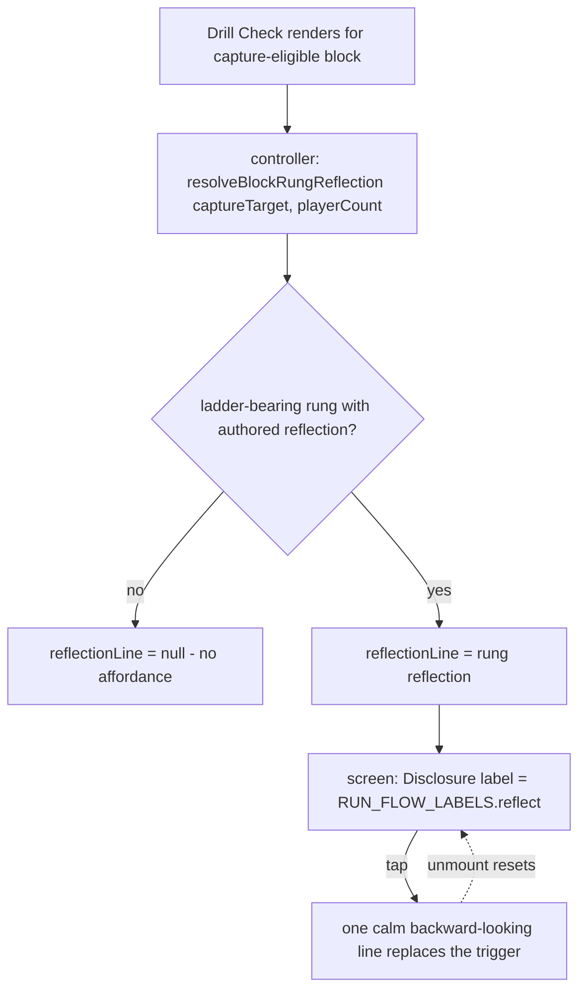

# feat: M002.2 Drill Check reflection — the After beat

**Origin:** `docs/brainstorms/2026-07-04-m002-2-drill-check-reflection-requirements.md`
**Plan type:** feat · **Depth:** Standard
**Created:** 2026-07-04

## Summary

Close the Rung-Aware Coaching Arc's third beat. A new authored per-`(focus, rung)` `reflection` field (backward-looking register, 14 strings) lands on the stress-rung record behind the existing hard presence gate; a pure domain helper resolves it from the just-finished block's drill-actual rung (the `resolveBlockRungIntent` pattern); Drill Check renders it behind a collapsed-by-default `Disclosure` ("What did that train?", lexicon-sourced) below the capture card. Pull not push, nothing persisted, chip stays the only gate. Requires the sanctioned beat-contract row amendment (Drill Check gains one reflective-field home; the `intent` ban there is untouched). Presentational + static-data only — no Dexie change (schema stays v7), no route change, no Home pixels.

## Problem Frame

The arc's why-before (`intent`, `D163`) and one-cue-during (`externalFocusCue`, `D176`) are shipped; the reflection-after is the committed next slice named in both. The moment right after the rep — when the athlete is already on Drill Check tagging the chip — is the retention-optimal beat where a coach would have spoken, and today the screen is deliberately sparse with no technique-how at all. Every existing rung field already owns its one home under the beat contract, so the reflection must be a **new field in a distinct register**, not a demoted re-render (the origin's "Why This Is Not An Echo" table).

## Requirements

Carried from the origin (`docs/brainstorms/2026-07-04-m002-2-drill-check-reflection-requirements.md`): R1 pull-to-reveal line on ladder-bearing Drill Checks; R2 collapsed by default, transient, nothing persisted; R3 new authored backward-looking field; R4 pure null-safe resolver, no block-type gate; R5 never gates Continue; R6 one home via beat-contract row amendment; R7 persistent affordance, no first-appearance gating; R8 lexicon-sourced label; R9 sparse screen stays sparse; R10 presentational + static-data only.

## Key Technical Decisions

- KTD1. **Field name `reflection` on `StressRung`.** Sits beside `intent` / `externalFocusCue` / `explorationCriterion` / `graduationFeel`; the doc-comment carries the register rules (one calm past-facing sentence; process-framed, never a grade per `D154`; no rung numbers per `D157`; no em-dash; no pass/fail vocabulary). All 14 rungs ship the field in the same change — the `rung_content_missing` hard gate extends to it, so partial authoring cannot land (mirrors the M002.2 progression-content layer).
- KTD2. **`Disclosure`, not `Expander`.** The screen's existing collapsed-by-default primitive (the capture drawers' shape): the trigger is replaced by the revealed line, and unmount resets it — R2's transient reveal for free, no new state, no new primitive. The question-becomes-answer interaction ("What did that train?" → the line) reads calmer than a chevron toggle. One-way per visit is a deliberate contract (origin R2): no re-collapse until unmount; the re-collapsible `Expander` was rejected because a one-sentence reveal does not earn a second control and same-screen idiom consistency wins.
- KTD3. **Resolver keys off the capture-target block.** `resolveBlockRungReflection(block, playerCount)` in `app/src/domain/drillMetadata.ts`, structurally identical to `resolveBlockRungIntent` (primary focus via `getBlockSkillFocus`, drill-actual rung via `stressRungForDrill`, `getStressRung(...)?.reflection ?? null`). The Drill Check controller already exposes the just-finished block as `captureTarget` and has `plan.playerCount` in scope — the controller passes those; the screen stays thin. No block-type gate at the resolver tier (matches the intent and live-cue helpers); surface coverage is bounded by where Drill Check mounts (KTD6, origin R4 accepted edge).
- KTD4. **No first-appearance gating (R7).** Deliberately NOT the `resolveBlockOpeningIntent` prefix-scan pattern: the affordance is persistent and predictable on every ladder-bearing Drill Check. Collapsed it costs one quiet line; a control that comes and goes cannot be habituated.
- KTD5. **Label in the lexicon.** `RUN_FLOW_LABELS.reflect = 'What did that train?'` — one canonical string, founder-swappable, pinned by the lexicon test. Drill Check becomes a **new** lexicon consumer with this slice (the cross-surface guard mounts only Transition + Run and does not cover it), so U4's RTL assertion on the rendered trigger label is the actual pin against per-screen drift.
- KTD6. **Bypass path untouched; coverage bound accepted.** The reflection renders only when Drill Check itself renders (capture-eligible blocks). The existing bypass set — warmup/wrap, non-count support slots (`non_count_support_slot`, e.g. `d38` in a technique slot), missing catalog ids — is unchanged, so a ladder-bearing support-slot block gets the before/during beats but no after beat (origin R4 accepted edge; widening capture eligibility is a separate product decision, not this slice). Both eligibility shapes get the affordance across all three capture shapes (count / streak / difficulty-only — it keys off the block's ladder status, not the capture shape).

## High-Level Design

## Implementation Units

### U1. Authored `reflection` field + spec + validation

- **Goal:** Every stress rung carries an authored backward-looking reflection, gated and linted like its siblings.
- **Requirements:** R3, R10.
- **Dependencies:** none. Ships first (content before surface, the arc's floor-before-trunk discipline).
- **Files:**
  - `app/src/data/stressLadders.ts` (add `readonly reflection: string` to `StressRung` + 14 authored strings; refresh the stale header comment that still reads "`externalFocusCue` and any Run / Drill Check treatment stay deferred")
  - `docs/specs/stress-rung-taxonomy.md` (Progression Content section: add the field + register/authoring rules)
  - `app/src/data/catalogValidation.ts` (extend the `rung_content_missing` tuple list with `['reflection', rung.reflection]`)
  - `app/src/data/__tests__/stressLadders.test.ts` (extend the progression-content lints: no em-dash, no pass/fail vocabulary, no rung-number vocabulary, single-sentence check on `reflection`)
  - `app/src/data/__tests__/catalogValidation.test.ts` (presence-gate coverage for the new field)
- **Approach:** Author the 14 strings (pass 1–5, serve 1–4, set 1–5) in the register: one calm sentence, past-facing ("That rep was …" / "You were …" voice), naming the rung's training effect as felt work, never a judgment of how the rep went. **Distinct-from-siblings rule (origin R3):** a reflection must not be a tense-transform of the rung's `intent` — it names a mechanism or effect neither `intent` nor `explorationCriterion` already states; review each string against its rung's four sibling fields before landing, **plus a fifth comparison**: it must not restate the `successMetric.description` of any drill on that rung — the "You aimed for:" observable line co-renders a few rows above the reveal on the same screen, so a paraphrase of it reads as an echo at exactly the reveal moment (checklist item, not a mechanical guard). Under `D130` the strings are agent-drafted, founder-reviewed through dogfood.
- **Register examples (voice-setting, final strings authored here):** pass rung 1 `intent` is "Groove a repeatable pass on a steady feed." — a bad reflection is its tense-flip ("That rep was grooving a repeatable pass"); a good one adds the mechanism: "That rep was building one contact point you can find without looking." Serve top rung (staying/deepening, like `graduationFeel`'s ladder-top rule) reflects depth, not stepping.
- **Test scenarios:** a rung with an empty `reflection` produces `rung_content_missing`; real catalog passes the hard gate; lint lanes (em-dash and en-dash rendered-copy rules / pass-fail / rung-number / sentence count) extend to `reflection` and pass on all 14 authored strings, failing on synthetic violations; a mechanical distinctness guard fails any rung whose `reflection` equals its `intent` or duplicates it after tense-normalization (coarse token-overlap check — the semantic bar stays on the authoring checklist).
- **Verification:** `npx vitest run src/data` green; `validateDrillCatalog` still `[]` on the real catalog.

### U2. Domain resolver

- **Goal:** Pure null-safe block → reflection resolution at the domain tier.
- **Requirements:** R4.
- **Dependencies:** U1.
- **Files:**
  - `app/src/domain/drillMetadata.ts` (add `resolveBlockRungReflection`)
  - `app/src/domain/__tests__/drillMetadata.reflection.test.ts` (new)
- **Approach:** Mirror `resolveBlockRungIntent` byte-for-byte in structure: `getBlockSkillFocus(block, playerCount)` → `stressRungForDrill(focus, drillId)` → `getStressRung(focus, rung)?.reflection ?? null`. No guard (nothing to protect — the reflection substitutes for nothing), no budget gate (READ-register reveal, not the live cue slot), no block-type gate (KTD3).
- **Test scenarios:** on-ladder pass drill → its rung's reflection; different rung → different string; dual-focus drill (`d08`/`d20`) resolves against the primary-focus ladder; warmup/off-ladder/no-`drillId`/null block/unknown rung → `null`, no throw.
- **Verification:** domain tests green.

### U3. Lexicon label

- **Goal:** One canonical affordance label.
- **Requirements:** R8.
- **Dependencies:** none (parallel with U1/U2).
- **Files:**
  - `app/src/contracts/runFlowLexicon.ts` (add `reflect: 'What did that train?'`)
  - `app/src/contracts/__tests__/runFlowLexicon.test.ts` (pin)
- **Verification:** lexicon tests green.

### U4. Wire into Drill Check

- **Goal:** The collapsed affordance below the capture card, revealed on tap, absent off-ladder.
- **Requirements:** R1, R2, R5, R7, R9, R10.
- **Dependencies:** U1, U2, U3.
- **Files:**
  - `app/src/screens/drillCheck/useDrillCheckController.ts` (expose `reflectionLine` — `useMemo` over `captureTarget` + `plan.playerCount`)
  - `app/src/screens/DrillCheckScreen.tsx` (render `Disclosure` below the `PerDrillCapture` block when `reflectionLine != null`)
  - `app/src/screens/__tests__/DrillCheckScreen.perDrillCapture.test.tsx` (extend, or a new colocated `DrillCheckScreen.reflection.test.tsx` if the file is crowded)
- **Approach:** Controller: `reflectionLine = useMemo(() => resolveBlockRungReflection(captureTarget, plan?.playerCount ?? 1), [captureTarget, plan])`. Screen: immediately below the `PerDrillCapture` section at the body's standard gap — NOT anchored at the body's end, so the question-form trigger never abuts the footer's gating hint (two stacked instruction-shaped lines would read as part of the gate) and stays out of the bottom-third handoff band the outdoor brief reserves for the primary action. Render: `{reflectionLine != null && (<Disclosure label={RUN_FLOW_LABELS.reflect} testId="drill-check-reflection">…</Disclosure>)}`. Trigger differentiation: pass `className="underline decoration-dotted"` on this Disclosure only — the dotted underline is the app's established tap-to-read idiom (`GlossInline`), so the read-pull stops sharing an identical treatment with the data-entry drawer pulls. Revealed line: exactly `text-base leading-relaxed text-text-primary` in a `
` (byte-matching the Run live "Now"-cue payload, the app's one shipped body-read coaching treatment; origin R9's 16px minimum), no heading, no card — wrapped in a focus-target `div` with `tabIndex={-1}` and `focus:outline-none` (the `ScreenShell.Body` programmatic-focus precedent) that receives focus on mount, because the reveal unmounts the focused trigger and the content is static text with no focusable landing. Footer, gating hint, and Continue untouched.
- **Test scenarios (RTL):** ladder-bearing count-shape block → collapsed trigger renders with the lexicon label; tap → the rung's reflection text appears, trigger gone, revealed container holds focus; streak and difficulty-only shapes → same affordance; off-ladder block → no trigger, no line; Continue gating identical with the affordance untouched and with it expanded; bypassed warmup → screen not rendered (routing regression, existing coverage).
- **Verification:** screen tests green; full `tsc -b` + `eslint .` clean; 390x844 mobile screenshot pass covering collapsed, revealed, and revealed-with-count-drawer-expanded states (the density high-water mark).

### U5. Beat contract + docs sync

- **Goal:** The one-home contract names the new field; canonical surfaces stay true.
- **Requirements:** R6.
- **Dependencies:** U4 (ship-time sync).
- **Files:**
  - `docs/specs/run-flow-beat-contract.md` (add the reflection row: full-weight home = Drill Check, pull-to-reveal — the pull posture is the home's deliberate render form, not a demotion; must-not-render = Run get-ready, Run live, Review, and the Transition orphan; note the `intent` Drill Check ban is untouched)
  - `CONCEPTS.md` (add "Rung reflection" entry)
  - `docs/decisions.md` + `docs/status/current-state.md` + `docs/catalog.json` + milestone doc (ship-time decision row + snapshot entry, same pass as the ship commit)
- **Verification:** `bash scripts/validate-agent-docs.sh` green.

## Scope Boundaries

### Deferred for later (named, not built)

- Chip-conditioned stress-vs-execution split (persisted capture → data-model slice with its own decision packet; gate on either dogfood signal from this slice: wanting to record why it was hard, or wanting in-the-moment stress-vs-execution disambiguation).
- Before — get-ready analogy depth layer + `analogyCue`.
- Self-tuning — verdict-history calibration.
- Drill-level reflection override (origin OQ3) — rung-level only for v1.
- First-reveal-per-`(focus, rung)`-per-session gating — a named fallback knob if dogfood shows repetition fatigue rather than filler strings (origin OQ4); not built.

### Outside this product's identity

- AI-generated or open-ended reflections (`P7`); any quiz/grading framing of the post-rep moment; the audio cockpit fork.

## Open Questions

- OQ1 (origin): label wording — build with `What did that train?`; founder swaps in one lexicon string if taste differs at dogfood. Evaluate against the quiz-framing exclusion: the label sits directly below the required capture question and must read as the athlete's own question to pull, never a second ask.
- OQ2 (origin): **resolved at plan review** — the trigger renders immediately below the `PerDrillCapture` section at the body's standard gap; end-of-body anchoring is ruled out (gating-hint adjacency would make the pull read as part of the gate, and the outdoor brief reserves the bottom-third handoff band for the primary action). Verify against the real 390x844 render at dogfood.

## Risks & Dependencies

- The register is the real risk: 14 strings that read as filler kill the feature. Mitigation: the origin R3 distinct-from-siblings rule plus U1's mechanical distinctness guard, and the origin's revert condition (delete affordance + field, render-only + static data).
- Dogfood watch items: the within-session same-string repeat is the common case (distinguish repetition fatigue from filler strings; origin OQ4 names the fallback knob), and the collapsed trigger shares the accent-underline idiom with the optional capture drawers — two same-styled pulls with different payloads (data entry vs. coaching read) sit within a few rows on count/streak blocks.
- Slice-1 sequencing gate: discharged by founder call (the 2026-07-05 `/lfg` direction) with the trunk's felt-quality revert window still open; if the trunk later reverts, the reflection stands alone as rung-content depth but the arc's phase-matched premise weakens — re-read the shape at the first dogfood checkpoint (origin Dependencies disposition).
- Depends on `getBlockSkillFocus` / `stressRungForDrill` / `getStressRung`, the `Disclosure` primitive, and `captureTarget` + `plan.playerCount` in the Drill Check controller — all shipped and stable.
- The beat-contract amendment is additive (a new row), so no shipped surface changes homes; rollback is a row delete.

## Sources & Research

- Precedent helpers: `resolveBlockRungIntent` / `resolveBlockLiveCueOverride` in `app/src/domain/drillMetadata.ts`; rung data + accessors in `app/src/data/stressLadders.ts`.
- Surface: `app/src/screens/DrillCheckScreen.tsx` (sparse-body contract, capture branches), `app/src/screens/drillCheck/useDrillCheckController.ts` (`captureTarget`, plan in scope), `app/src/components/ui/Disclosure.tsx` (collapsed-by-default reveal).
- Validation lanes: `rung_content_missing` in `app/src/data/catalogValidation.ts`; progression-content lints in `app/src/data/__tests__/stressLadders.test.ts`.
- Contract + canon: `docs/specs/run-flow-beat-contract.md` (one home per field; the ideation-sanctioned row amendment), `docs/specs/stress-rung-taxonomy.md` (field authoring rules), `.cursor/rules/courtside-copy.mdc` (register invariants), `D154`/`D157` (never gates / no raw rungs).
- Arc lineage: `docs/ideation/2026-06-30-m002-2-technique-how-depth-ideation.md` (Idea 3 + synthesis), `docs/brainstorms/2026-06-30-m002-2-rung-aware-coaching-arc-requirements.md` (the committed-next-slice deferral), `docs/plans/2026-06-30-001-feat-m002-2-rung-aware-live-cue-plan.md` (D176, shipped).
