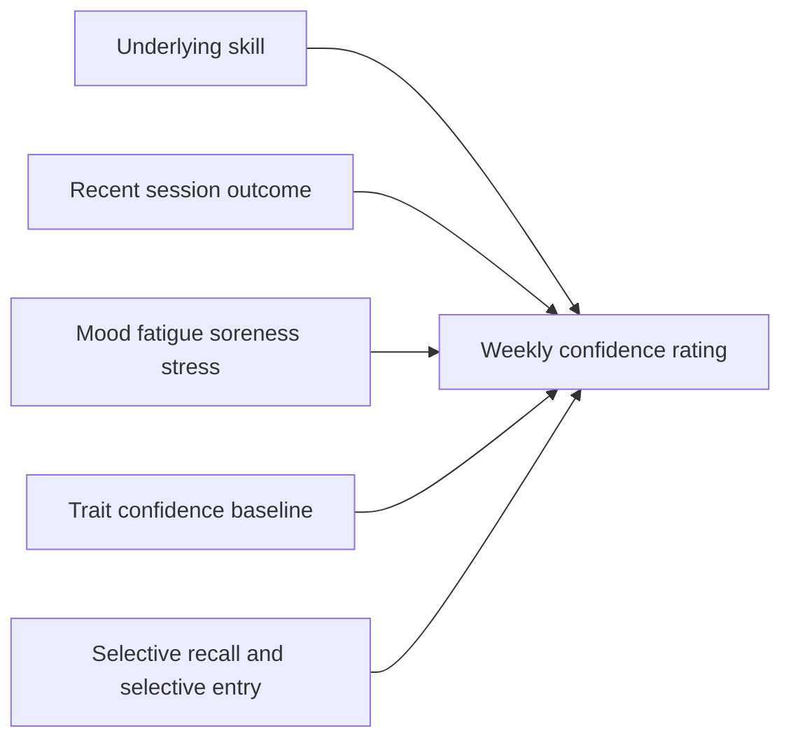

# Vendor response: subjective skill-confidence validity (vendor 2, 2026-06-02)

## Provenance and handling

- **Vendor:** vendor 2 (identifier preserved for the reconciliation pass; redact before any external share).
- **Received:** 2026-06-02 (brief authored 2026-05-27).
- **Responds to:** [`docs/research/briefs/2026-05-27-brief-subjective-skill-confidence-validity.md`](../2026-05-27-brief-subjective-skill-confidence-validity.md) — the subjective-skill-confidence-validity brief listed in [`docs/research/briefs/README.md`](../README.md).
- **Status:** `verbatim`. This file is the raw deliverable as received. No base64 image data URIs were present. The response contains inline `citeturn…` source-tool tokens (e.g., `citeturn8view2`) and one Mermaid diagram block; these are **preserved verbatim** and not resolved or removed. Prose is unaltered. Corrections and commentary live in the distillation note linked below.
- **Distilled in:** [`docs/research/subjective-skill-confidence-validity.md`](../../subjective-skill-confidence-validity.md) — use that note for repo-facing conclusions, cross-links, and decision implications.
- **Convention:** revision-by-replacement per `docs/research/briefs/README.md`. If vendor 2 submits a revised response, it ships as a new `-vendor-2-revised-<date>.md` file; this file is not edited in place.

## Verbatim response

# Weekly Self-Rated Skill Confidence as a Proxy for Skill Development

## Executive summary

The best evidence does **not** support using a weekly **single-item self-rated skill-confidence** score as the **sole** longitudinal proxy for actual week-to-week skill development in adult recreational skill-sport athletes. It has **some construct validity**, but mostly for **perceived capability/readiness** rather than cleanly for underlying skill change. In the available sport literature, state confidence is systematically shaped by **recent performance feedback, session quality, and other situational cues**; in adjacent self-tracking literature, subjective state logs are also shaped by **selective reporting and context effects**. In plain English: weekly confidence is not “just noise,” but it is too contaminated by short-horizon state to stand alone as a skill-progress metric. My confidence in that conclusion is **moderate** because the exact target-population literature is thin and much of the best evidence comes from adjacent populations and competition-focused sport psychology rather than self-coached adult recreation. citeturn8view2turn8view4turn41view2turn27search1turn44view0

The most defensible product decision is therefore: **do not present weekly confidence as “your skill is improving”**. If you ship it, ship it as a **secondary perceived-confidence trend**, clearly labeled as subjective, skill-specific, and contextual. For the primary user-facing progress signal, the strongest option among the behavioral candidates you listed is **skill-specific completed drill/practice volume**, not raw session count. Even that is only a partial proxy. If the product can support it, the best architecture is a **hybrid**: behavioral exposure as the main weekly signal, plus a slower **periodic behavioral benchmark** for actual skill, plus confidence as a secondary contextual trace. citeturn10view0turn37search0turn37search9turn41view2

If you do ship the confidence item, the most defensible format is a **single skill-specific 7-point fully labeled Likert item**, asked on a fixed weekly cadence and explicitly framed around **typical execution in normal practice over the last 7 days**, not “since last week,” not “after today’s practice,” and not “overall game confidence.” A recommended item is:

> **Thinking about your _[skill]_ over the last 7 days, how confident are you that you can execute it reliably in a normal practice right now?**

Recommended anchors:

| Response | Label |
|---|---|
| 1 | Not at all confident |
| 2 | Slightly confident |
| 3 | A little confident |
| 4 | Moderately confident |
| 5 | Quite confident |
| 6 | Very confident |
| 7 | Completely confident |

That recommendation follows the response-scale literature showing that psychometric precision drops with very small category counts, but there is little evidence of meaningful gain beyond roughly six to seven options, including no clear advantage for VAS over Likert in modern comparisons. Fully verbalized categories also tend to improve measurement quality. citeturn22search3turn22search4turn23search1turn19search19turn20search6

## What a weekly confidence item actually measures

The state–trait distinction matters here. Vealey’s foundational sport-confidence work explicitly separated **trait sport-confidence** from **state sport-confidence**, and the original validation involved **666 high school and college athletes**; trait confidence, competitive orientation, actual performance, and perceived performance all helped explain state confidence. The same dissertation also found that males, older athletes, and more experienced athletes scored higher on state confidence. The important point for your product question is simple: sport confidence is not a unitary stable quantity. Even in the foundational model, **state confidence is partly downstream of recent performance appraisals**. citeturn8view0turn8view2

That matters because your proposed weekly item is not a trait inventory. It is much closer to a **compressed state summary**. In adjacent competitive-sport work, the State Sport Confidence Inventory has shown strong internal consistency, but the evidence is mostly from competitive populations, not self-coached recreational adults. In one diary-style study, **176 white male UK/Irish athletes** with mean age **20.3 years** and mean sport experience **10.42 years** completed repeated state-confidence ratings around competition; SSCI internal consistency in that sample was **α = .94**, and reliability across the six assessment points was reported as **α = .91**. That demonstrates that repeated state-confidence measurement is psychometrically feasible. It does **not** demonstrate that a single weekly item cleanly indexes real skill change. citeturn8view4

There is also a construct-validity boundary that product teams often blur: **confidence rating is not performance self-scoring**. Your question correctly separates these. The amateur-golf literature shows that self-efficacy/confidence is influenced by handicap achievement and practice satisfaction, but that is still a belief-state literature, not a literature showing that one global weekly confidence number is a clean longitudinal measure of skill. In other words, existing sport-confidence tools show that confidence is a real construct; they do **not** solve the proxy problem you are trying to solve. citeturn10view0turn8view2

A compact way to think about the weekly item is this:

So the question is not whether the signal is “valid” in the abstract. It is whether the variance in the observed weekly score is mostly the variance you care about. On current evidence, the answer is **no** for use as a stand-alone skill-development proxy. citeturn41view2turn27search1turn44view0

## Recommended scale format and wording

The literature does not give a target-population-specific winner, but it does narrow the decision.

First, single-item measures are most defensible when the construct is **narrow and concrete**, not broad and fuzzy. That pushes you toward **skill-specific confidence** rather than “overall game confidence right now.” It also pushes you away from trait wording such as “in general.” citeturn18search0turn15search8

Second, response-scale evidence is surprisingly consistent on one point: very short scales lose precision, but very long scales offer diminishing returns. Lozano et al. simulated 30-item rating scales across item correlations and sample sizes from **N = 50 to N = 500** and found that reliability and validity improved as response options increased, with the practical optimum between **four and seven** categories and little gain above seven. In a direct empirical comparison, Simms et al. randomized **1,358 undergraduates** to response scales ranging from **2 to 11 options** plus a **VAS** and found attenuated psychometric precision with **2–5** options, but **no psychometric advantage beyond 6**, including no meaningful edge for VAS. Leung’s study of **1,217 students in Macau** found no major internal-structure differences across **4-, 5-, 6-, and 11-point** scales; the **11-point** version was most normal statistically, but predictive-validity differences were inconclusive. Meanwhile, questionnaire-design guidance reports that **fully verbalized rating categories** tend to improve reliability and validity relative to only endpoint labels. citeturn22search3turn22search4turn23search1turn19search19

That evidence leads to an opinionated recommendation:

| Format | What the evidence says | Product implication | Verdict |
|---|---|---|---|
| **5-point Likert** | Lower burden, but scales with **2–5** options show attenuated precision in the **N = 1,358** Simms study. citeturn22search4 | Probably too coarse for subtle week-to-week movement. | **Not preferred** |
| **7-point Likert** | Sits inside Lozano’s practical **4–7** optimum; avoids pseudo-precision while preserving sensitivity. Fully labeled categories help. citeturn22search3turn19search19 | Best trade-off for one-tap weekly use. | **Recommended** |
| **11-point Likert/NRS** | In **N = 1,217**, 11-point looked more normal, but internal and predictive advantages were not decisive. citeturn23search1 | More apparent sensitivity, but also more pseudo-precision and noisier week-to-week interpretation. | **Acceptable, not preferred** |
| **VAS** | In **N = 1,358**, no psychometric advantage emerged beyond six options, including VAS; EMA comparisons remain mixed. citeturn22search4turn20search6 | More UI friction for little benefit. | **Avoid** |
| **“More / same / less confident than last week”** | No direct support found for this use case; by construction it leans on retrospective comparison and recency. citeturn41view2turn44view0 | Likely maximizes memory error and last-session contamination. | **Avoid** |

The exact item should also avoid language that collapses the construct. “How confident are you in your overall game right now?” is too global. “How much did today’s session improve your confidence?” is explicitly session-end and therefore maximally state-contaminated. “How much have you improved since last week?” is not confidence at all; it is a retrospective self-judgment-of-change and is likely the worst of the set for recency bias. The cleanest surviving framing is **task-specific capability under typical practice conditions**. citeturn8view2turn41view2

## Failure modes and confounds

The dominant failure mode is **recent-session contamination**. In a diary study of **49 athletes** over **15 consecutive training sessions**, Carpentier and Mageau found that higher-quality session feedback predicted same-session self-confidence: change-oriented feedback quality had a coefficient of **γ = .14 (p < .05)** and promotion-oriented feedback quality **γ = .12 (p < .001)**, while the feedback variables explained **17.14%** of the **within-athlete** variance in self-confidence. That is a big deal for your use case. If one training session can move nearly a fifth of the within-person variance in perceived confidence, then a weekly single-item rating will inevitably be partly a **memory of the week’s most salient feedback episode**, not a clean read on accumulated skill change. citeturn41view2

A second failure mode is **performance-outcome anchoring**. In the repeated-competition diary study of **176 male athletes** described above, the robustness of confidence beliefs mattered: the correlation between robust trait confidence and state-confidence variability was **r = -.37 (p < .001)**, meaning athletes with less robust confidence fluctuated more. Pre-match confidence explained **36.5%** of post-match confidence variance, and performance plus trait robustness added another **ΔR² = .27**, with the performance-by-robustness interaction adding **ΔR² = .03**. That is competitive rather than recreational evidence, but it strongly suggests that state confidence is structurally vulnerable to **last-outcome effects**, especially in less stable individuals. citeturn8view4

A third failure mode is **training-load, soreness, and mood contamination**. The best direct confidence-specific effect sizes in adult recreational skill sports are largely missing. But the broader athlete-monitoring literature is clear that subjective self-reports are highly sensitive to training load. Saw et al.’s systematic review synthesized **56 original studies** and concluded that subjective wellbeing measures reflected acute and chronic training load with greater sensitivity and consistency than common objective markers, and subjective wellbeing typically worsened with acute load increases and improved when load dropped. Bandura’s theoretical framework also treats **physiological and emotional states** as one of the four major sources of efficacy judgments. Put together, that means soreness, fatigue, and stress are not side noise; they are upstream inputs into the confidence judgment itself. citeturn27search1turn24search0turn19search17

A fourth failure mode is **selective entry**. In a real-world interview study of **22 mood-tracking app users**, Schueller et al. found that some users were less inclined to record negative states and preferred documenting positive ones. That is not a sport-confidence study, but it is directly relevant to a self-coached weekly app context. If users skip bad weeks more often than good weeks, the confidence trace becomes biased upward and less diagnostic precisely when the product would most want sensitivity. citeturn44view0

Systematic miscalibration is real but more complex than the cliché “novices always overestimate.” Direct weekly-confidence evidence for adult recreational sport is thin. One useful adjacent study is climbing self-assessment: among **74 climbers**—**38 intermediate** and **36 advanced**—advanced climbers significantly **overestimated** non-dominant-hand half-crimp strength by about **9%** with **Cohen’s d = 0.64**, whereas intermediate climbers did not significantly over- or underestimate. So the available evidence does **not** support a simple one-way novice-overestimation story for your target use case. It supports a more annoying reality: **miscalibration depends on the specific subskill, the performer, and the context**. Direct evidence for “plateau-blindness” in 2–5 year self-coached adult sport participants was not found in the accessible literature and should be treated as an open question rather than an established fact. citeturn12view0

## Comparison with behavioral proxies

Behavioral proxies are less emotionally volatile, but they are also less direct than many product teams assume.

In amateur golf, Bruton et al. studied **197 male golfers**—**84 skilled** and **113 lesser-skilled**—and found that **handicap achievement** was the strongest predictor of post-round self-efficacy for both groups, while **practice satisfaction** was the strongest predictor of pre-round self-efficacy in lesser-skilled golfers. That is useful because it shows objective and subjective indicators are not interchangeable: confidence partly follows objective status, but it also depends on the athlete’s interpretation of practice. citeturn10view0

Climbing shows the same pattern. In an exploratory study of **365 climbers** with mean age **32.11 years**, climbing competence was positively associated with **training frequency**, **years of practice**, and **climbing self-efficacy/confidence**, and climbing confidence emerged as the strongest psychological predictor of competence. In another climbing study of **201 active climbers** aged **16–62**, higher self-efficacy predicted higher frequencies and difficulty levels for multiple climbing behaviors, with adjusted standardized coefficients generally in the **.17 to .38** range depending on behavior. Confidence is therefore not just an outcome marker; it is also a driver of what athletes attempt. That makes confidence attractive as a motivational signal but problematic as a pure proxy for skill growth. citeturn37search0turn37search2turn37search9turn10view4

A practical comparison looks like this:

| Proxy | What it captures best | What it misses | Bottom line |
|---|---|---|---|
| **Session count** | Simple exposure/adherence | Skill focus, quality, difficulty, transfer | Too weak on its own. |
| **Drill-completion rate** | Planned execution, habit formation | Whether drills targeted the right weakness; whether execution was good | Better than session count. |
| **Skill-specific practice volume** | Exposure to the target skill; closest listed behavioral proxy to skill development | Still blind to quality and calibration | **Best of the listed behavioral options**. |
| **Weekly confidence** | Perceived capability, readiness, motivation | Contaminated by feedback, fatigue, mood, recency | Useful **secondary** signal, weak **primary** proxy. |

So if the architecture must choose one of the listed weekly proxies, use **skill-specific completed practice/drill volume**, not confidence. If the product can afford a better design, the right answer is not either/or: use **behavioral exposure weekly**, confidence as **context**, and a **periodic behavioral benchmark** as the actual skill anchor. citeturn10view0turn37search0turn37search9turn41view2

## Practitioner intuition, shipped design patterns, and open gaps

The applied-sport practitioner literature is much more comfortable with self-report as a **monitoring input** than as a stand-alone performance proxy. In qualitative interviews with **30 athletes, coaches, and sport-science/medicine staff** across **20 sports**, Saw et al. found that accessibility, timing, social reinforcement, and buy-in all affected compliance, data accuracy, and usefulness. That points in one direction for your product: keep the item low burden and context-stable, but do not overclaim what the output means. citeturn27search8

The closest shipped-app analogue is not a sports app but modern mood-tracking design. Schueller et al.’s **22-user** interview study found that users valued simple entry and trend visualization, but also wanted help interpreting the data and sometimes avoided logging negative states. Apple’s shipped “State of Mind” feature follows that pattern closely: it explicitly separates **momentary emotions** from **daily moods**, uses a slider plus optional descriptors, and shows associations with life factors such as **exercise**, **sleep**, and **daylight** rather than treating the number as a stand-alone progress score. That is a strong product clue. If you ship confidence, you should probably ship it the same way: as a subjective context trace that lives alongside training and recovery context, not as “your skill score.” citeturn44view0turn44view2

The main open gap is stark. I did **not** find strong direct evidence on **adult recreational, self-coached, skill-sport athletes with 2–5 years’ experience, training 1–3 times/week, completing a single-item confidence rating weekly outside competition**. Most of the strongest sport-confidence evidence comes from either competitive athletes, repeated around competition, or multi-item scales. The exact target-population question is therefore still partly unanswered. The right validating study would be a **12–16 week multilevel field study** in adult recreational athletes, combining: weekly skill-specific confidence; weekly soreness/fatigue/mood and last-session outcome; weekly practice volume; and a periodic sportspecific behavioral benchmark. Without that sort of variance-partitioning design, teams will keep arguing from theory and adjacent evidence. citeturn8view4turn41view2turn27search1

## Full citations

Vealey, R. S. *The Conceptualization and Measurement of Sport-Confidence*. University of Illinois dissertation, validation program involving **666 high school and college athletes**; stable handle linked in citation. citeturn8view0turn8view2

Beattie, S., Hardy, L., Savage, J., Woodman, T., & Callow, N. (2011). Development and validation of a trait measure of robustness of self-confidence. *Psychology of Sport and Exercise, 12*(2), 184–191. **DOI:** 10.1016/j.psychsport.2010.09.008. citeturn8view4

Carpentier, J., & Mageau, G. A. (2016). Predicting sport experience during training: The role of change-oriented feedback in athletes’ motivation, self-confidence and needs satisfaction fluctuations. *Journal of Sport & Exercise Psychology, 38*(1), 45–58. **DOI:** 10.1123/jsep.2015-0210. citeturn40view0turn41view2

Lozano, L. M., García-Cueto, E., & Muñiz, J. (2008). Effect of the number of response categories on the reliability and validity of rating scales. *Methodology, 4*(2), 73–79. **DOI:** 10.1027/1614-2241.4.2.73. citeturn22search3

Simms, L. J., Zelazny, K., Williams, T. F., & Bernstein, L. (2019). Does the number of response options matter? Psychometric perspectives using personality questionnaire data. *Psychological Assessment, 31*(4), 557–566. **DOI:** 10.1037/pas0000648. citeturn22search4turn20search1

Leung, S.-O. (2011). A comparison of psychometric properties and normality in 4-, 5-, 6-, and 11-point Likert scales. *Journal of Social Service Research, 37*(4), 412–421. **DOI:** 10.1080/01488376.2011.580697. citeturn23search1

Verster, J. C., Mulder, K. E. W., Verheul, M. C. E., van Oostrom, E. C., Hendriksen, P. A., Scholey, A., & Garssen, J. (2023). Test-retest reliability of single-item assessments of immune fitness, mood, and quality of life. *Heliyon, 9*(4), e15280. **DOI:** 10.1016/j.heliyon.2023.e15280. citeturn16view3

Law, B., & Hall, C. (2009). Observational learning use and self-efficacy beliefs in adult sport novices. *Psychology of Sport and Exercise, 10*(2), 263–270. **DOI:** 10.1016/j.psychsport.2008.08.003. citeturn14view0

Bruton, A. M., Mellalieu, S. D., Shearer, D., Roderique-Davies, G., & Hall, R. (2013). Performance accomplishment information as predictors of self-efficacy as a function of skill level in amateur golf. *Journal of Applied Sport Psychology, 25*(2), 197–208. **DOI:** 10.1080/10413200.2012.705802. citeturn10view0

Wilson, R. C., Sullivan, P. J., Myers, N. D., & Feltz, D. L. (2004). Sources of sport confidence of master athletes. *Journal of Sport & Exercise Psychology, 26*(3), 369–384. **DOI:** 10.1123/jsep.26.3.369. citeturn33view0

Koehn, S., Pearce, A. J., & Morris, T. (2013). The integrated model of sport confidence: A canonical correlation and mediational analysis. *Journal of Sport & Exercise Psychology, 35*(6), 644–654. **DOI:** 10.1123/JSEP.35.6.644. citeturn32search1turn32search9

Saw, A. E., Main, L. C., & Gastin, P. B. (2016). Monitoring the athlete training response: Subjective self-reported measures trump commonly used objective measures: A systematic review. *British Journal of Sports Medicine, 50*(5), 281–291. **DOI:** 10.1136/bjsports-2015-094758. citeturn27search1

Schueller, S. M., Neary, M., Lai, J., & Epstein, D. A. (2021). Understanding people’s use of and perspectives on mood-tracking apps: Interview study. *JMIR Mental Health, 8*(8), e29368. **DOI:** 10.2196/29368. citeturn44view0

Apple Inc. *Log your state of mind in Health on iPhone*. Apple Support page; stable source linked in citation. citeturn44view2

Turchetto, M., Tomaselli, V., Leo, I., et al. (2025). Sport climbing competence is influenced by training frequency, experience, self-efficacy, flow, and emotional intelligence. *Frontiers in Psychology*. DOI not visible in the accessible snippets; stable source linked in citation. citeturn37search0turn37search2

Llewellyn, D. J., et al. (2008). Self-efficacy, risk taking and performance in rock climbing. *Personality and Individual Differences, 45*, 75–81. DOI not visible in the accessible snippets; stable source linked in citation. citeturn10view4turn37search9