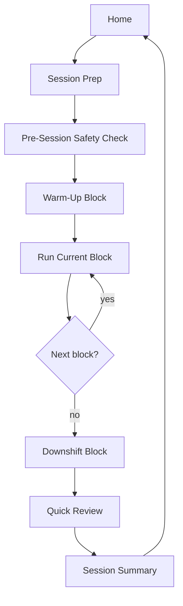

# M001 Courtside Run Flow

## Purpose

Define the user-visible run flow for the first implementation-ready slice:

- solo-first
- passing-fundamentals / serve-receive-transfer focused
- minimal taps
- believable under beach conditions

The v0a validation prototype in `app/` currently implements a partial version of this flow. M001 full build remains gated by field testing. See `docs/research/2026-04-12-v0a-runner-probe-feedback.md` for as-built deviations.

## Core principle

During a session, the phone should feel like a simple courtside helper, not a second sport.

For a new user, getting into that run flow should require only the minimum setup that changes the starter session: `skill level` and today's player count. Account creation, permissions, and metric tutorials belong later.

## Visual defaults for M001

- Use one high-contrast light theme. Do not spend M001 budget on theme switching.
- Use near-black text on white or slightly off-white surfaces, plus one vivid accent for primary actions and progress emphasis.
- Use the Inter font with a system sans fallback:
  - `"Inter", -apple-system, BlinkMacSystemFont, "Segoe UI", Roboto, Helvetica, Arial, sans-serif`
- Keep type comfortably large:
  - body text `>=16px`
  - `18px` preferred for run-mode labels
  - block titles `20px+`
  - timer / rep digits roughly `56-64px`
- Primary controls should use a `54-60px` touch target baseline with `8-16px` spacing.
- Every active-run screen should be parseable in one glance. If an element does not help the user act right now, it probably belongs on prep, pause, transition, or summary instead.

## Primary flow

Note: warm-up and Downshift are mandatory session blocks, not optional steps. The safety check gates and shapes the session before the warm-up begins. Stop/seek-help triggers are accessible from any screen during the session. ("Downshift" is the v0b-renamed cool-down block per `D105`; see `docs/specs/m001-session-assembly.md`.)

## Screen states

### 1. Home

Default goal:

- show today's suggested session or last edited session
- show one clear action: `Start session`

New-user secondary actions:

- `Change level or today's player count`

(The `See why this session was chosen` affordance is **not in v0b** per `H7` in the approved red-team fix plan; the `SessionDraft.rationale` schema field is reserved for M001-build UI.)

Repeat-user secondary actions:

- `Repeat this session` (per `D-C5` — duplicate-and-edit is folded into Repeat)
- `Adjust for today`

### 2. Session Prep

Show only the information needed before starting:

- session title
- duration
- skill focus
- environment
- expected equipment
- player count / mode fit

This screen should feel calm and summary-first. It is not a deep browsing or setup surface.

For the first run, the prep state should reinforce that this is a short starter session (`10-15` minutes) and that deeper edits can wait until after the first useful workout.

Actions:

- `Start now`
- `Swap drill`
- `Shorten session`
- Player mode changes: re-enter Setup via the Draft card's `Edit` secondary (per `D-C` / Phase C UX Surface 3 — no Session Prep screen in v0b).

Start rule:

- `Start now` locks the current session plan snapshot for this run.
- After start, use `Swap`, `Skip block`, and `End session` to record what actually happened instead of silently rewriting the original plan.

### 2.5 Pre-Session Safety Check

After the user taps `Start now` and before the warm-up block begins, show 2-3 fast safety taps that gate and shape the session. These should use the same large tap-first controls as the rest of the run flow.

**Pain flag (always shown):**

- `Any pain that changes how you move?`
- `Yes` / `No`
- If yes: the session defaults to a recovery/technique-only variant. The user sees a clear explanation and may override, but the default is conservative.

**Training recency (shown when not auto-derivable from session history):**

- `Trained in last 7 days?`
- `0` / `1` / `2+`
- If 0: session automatically scales down volume and intensity.

**Heat awareness (contextual, shown once per session on hot days):**

- A single CTA revealing heat exhaustion/stroke symptoms and "stop if…" guidance. Not a quiz or gate — a reference tap.

Design rules:

- Same large controls, high-contrast light theme, and outdoor-readable type as the run flow.
- Must not feel like a medical questionnaire. These are fast taps, not a form.
- If both answers are "safe" (no pain, trained recently), the transition to warm-up should feel near-instant.
- If the pain flag triggers a recovery session default, the user should see why and can override with one deliberate tap.
- Prefer answer-first copy over question-first copy. "We'll avoid impact today because you reported knee pain" is better than a standalone pain checkbox with no visible payoff.

Placement is an open question (`O16`):

- M001 default is Variant A, the standalone screen documented above. Do not change the default until tester evidence exists.
- Variant B folds the pain flag and recency chips into `Session Prep` / `Today's Setup` and branches to the richer safety flow only when a red flag fires.
- Variant C compresses the pre-session ask to the minimum needed before Run (pain flag plus auto-derived or single-tap recency) and defers richer profile capture to a one-screen prompt on the next Home visit.
- Any variant must preserve the hard requirements in `D82`, `D83`, and `D88`: binary pain flag, training-recency capture, contextual heat CTA on hot days, and offline-reachable stop/seek-help from any session state.

See `docs/research/onboarding-safety-gate-friction.md` for the evidence base and the specific measurement plan.

### 2.6 Warm-Up Block

The first block of every session is a mandatory warm-up. The user can shorten it but cannot skip it entirely.

Content should include ankle/landing preparation, shoulder activation, and gradual intensity ramp. Exact content needs volleyball coach review.

Warm-up uses the same run-block UI (timer, cues, progress) as main work blocks. The block title should make it clear this is warm-up.

### 3. Run Current Block

Visible at all times:

- block title
- one primary coaching cue
- oversized timer (countdown-first) or rep target
- current phase label (e.g., "WORK" / "REST")
- current progress (block index, e.g., 3/10)
- primary action button

Allowed actions:

- `Next`
- `Pause`
- `+15s` (during rest)
- `Skip Rest` (long-press, during rest)
- `Swap` (live in v0b per Phase F 2026-04-19; cycles to next-ranked curated alternate within the same block slot; preserves durationMinutes / type / required; mutates ExecutionLog.plan only, never SessionPlan snapshot per D37; pauses timer; disabled on warmup / wrap)
- `Shorten`
- `Skip block`
- `End session`

Courtside action rule:

- keep `Next` and `Pause` (and rest controls) as the primary always-visible controls
- give those controls the largest targets on screen (`54-60px` baseline with clear spacing)
- make the timer or rep target the dominant visual element
- `Swap` is a first-class courtside action (visible in both active and paused states); lands in v0b per Phase F 2026-04-19 — previously deferred. Tap cycles the current block's drill to the next-ranked curated alternate within the same block slot, preserving `durationMinutes` / `type` / `required`. Swap mutates `ExecutionLog.plan.blocks[idx]` only; the original `SessionPlan` snapshot stays locked per `D37`. Swap pauses the timer (same semantics as `Shorten`); the user taps Resume to continue. Warm-up and wrap blocks are disabled for Swap per `D85` / `D105` (curated content that shouldn't be replaced mid-drill).
- place `Skip block` and `End session` in a secondary overflow pattern or pause state
- keep longer instruction text off the live screen; deeper cue lists belong before the block starts or while paused
- use Auto-Go (auto-advance) by default, with a short "3-2-1" pre-roll transition cue before work phases
- **foreground audio cue at block-end and on each preroll tick** (Phase F 2026-04-19, narrow slice of the originally-deferred `V0B-08` layered cue stack). Single-tone ~250 ms tone at block-complete; ~100 ms tick per preroll second. Fire-and-forget via `AudioContext` oscillator — best-effort, silent failure on autoplay-policy rejection or absent `AudioContext`. Honors iOS silent switch by default (by design — a silent user asked for silence). Compatible with `D54` (which scoped "no background audio / no iPhone haptics in M001" — foreground audio is a different carve-out). Required v0b baseline because `navigator.vibrate` is unsupported on iOS Safari PWA (`D57`), so without the beep a phone set down on a towel has no reliable block-end signal and the `phone courtside viable` D91 hypothesis cannot be honestly tested.
- counter is a single tap during rest for a block-level marker (`Good` / `Not Good`), rather than per-rep tapping
- attempt Screen Wake Lock to keep the screen awake during the session
- persist run state locally at session start and every meaningful transition so the session can recover after reload, close, or interruption

### 3.5 Between-Block Transition

When a block ends, the user should get a short transition moment before the next block begins.

Show:

- completed block name
- next block name
- next block duration
- one cue about what changes next

Primary action:

- `Start next block`

Secondary actions:

- `Shorten block`
- `Skip block`

For the Phase 0 validation runner (`v0a`), a minimal version of this transition is required: next block label, duration, and one primary action. The full secondary actions and richer cue context start in the Starter Loop build target.

### 3.6 Downshift Block (renamed from Cool-Down per `D105`)

The last block of every session is a mandatory Downshift block. The user can shorten it but cannot skip it entirely. The v0b-renamed name is "Downshift" — the prior "Cool-down" label implied a recovery claim the evidence does not support.

Content should include gentle movement and light stretching framed as transition and comfort, not as recovery or injury prevention. Exact content needs volleyball coach review.

Downshift uses the same run-block UI as other blocks.

### 3.7 Stop/Seek-Help Reference

A persistent "Safety" or "Stop if…" affordance should be accessible from any screen during the session (overflow menu, pause state, or similar). Tapping it reveals:

- Chest pain or pressure
- Extreme or unusual breathlessness
- Irregular or racing heartbeat
- Dizziness, lightheadedness, or fainting
- Confusion or disorientation
- Heat stroke red flags: confusion, cessation of sweating, hot/dry skin
- Injury pain that persists, worsens, or changes how you move

Copy: "Stop training. If symptoms are severe or don't resolve quickly, call emergency services."

This is passive reference, not algorithmic triage. It must work offline.

### 4. Quick Review

Should appear even after a partial session.

Visual rule:

- preserve the same high-contrast light theme and large tap-first controls from run mode
- default to large buttons or segmented choices over precision-heavy controls when possible
- keep optional note entry visually secondary so the user can finish review without feeling pulled into typing

Required inputs:

- session RPE (sRPE)
- one skill metric
- one-tap early-end reason when the session was partial

Optional input:

- quick tag
- short note

Actions:

- `Submit review`
- `Finish later`

Review timing rule:

- prefer delayed sRPE capture `10-30` minutes after session end when possible
- allow immediate fallback when a delayed capture would likely be missed
- if delayed capture is used, keep the pending review visible without turning it into repeated interruption spam

### 5. Session Summary

Keep this short:

- what got completed
- one metric summary
- one suggested next step

Primary action:

- `Done`

This is not a dashboard. It is a short confidence-building handoff back to the home surface.

Any next-session suggestion in M001 should appear here as a single line of guidance or on the home surface after return, not as a separate new screen.

## Pair fallback behavior

M001 should not assume deep live replanning.

Fallback rule:

- before the session starts, let the user switch affected drills or blocks to a solo/pair-compatible fallback
- launch drills that change meaning by player mode should have curated solo/pair variants, not just metadata labels
- after the session starts, prefer continuity tools such as `Swap`, `Skip block`, or pre-authored variants over rebuilding the whole session

## Interruption states

### Pause

- timer pauses
- user can resume without losing progress
- persist execution status, active block, and timing anchors before leaving the pause transition

### Skip block

- block is marked skipped, not completed
- session can continue

### End early

- partial session is preserved
- local session state is written before showing review
- review still prompts with partial context
- execution ends, but the locked plan remains available for later comparison or duplication

### Phone lock or app background

- persist execution status, active block ID, per-block status, and timing anchors on every state-changing action
- on return or relaunch, user lands on a resume prompt for the active block, not on an auto-advancing timer
- because browsers throttle background timers, recovery must use timestamp-based truth rather than relying on timer ticks
- immediately move the live run into a safe paused or interrupted state on hide
- on return, if timer drifted, show a simple recovery choice:
  - `Resume (pause elapsed)` - default for training safety
  - `Resume (reconcile time)`
- if an app update is discovered during the session, defer activation until the user reaches a safe boundary such as home, review completion, or explicit exit

## Minimal execution contract

- Execution statuses: `not_started`, `in_progress`, `paused`, `ended_early`, `completed`
- Block statuses: `planned`, `in_progress`, `skipped`, `completed`
- Persist locally on every state change: execution status, active block ID, per-block status, and timing anchors such as start and pause times
- If the app relaunches with an unfinished session, default to a resume choice that re-enters the active block in a safe paused state

## Platform capability guardrails

- Treat visual controls, readable text cues, and resumable session state as the guaranteed baseline.
- Screen wake lock is a best-effort enhancement, not a dependency. If the phone still locks, the user should be able to recover cleanly.
- Haptics or vibration can supplement transitions on supporting devices, but no critical cue should rely on them (iOS Safari PWA: unsupported).
- **Foreground audio cues** (block-end beep, preroll tick) are best-effort and gated on `AudioContext` + user-gesture. They are the *primary* block-end signal for iOS Safari PWA testers (where vibrate is unsupported); failure paths silently fall back to the visual transition so the run loop never depends on sound. Honors the iOS silent switch by default. See Phase F 2026-04-19 (`V0B-08` narrow slice) and `D54` (which remains correct for background audio and iPhone haptics — foreground audio is a compatible carve-out).
- Backgrounding may interrupt timer precision, so recovery beats pretending timing stayed perfect.
- App updates should never interrupt an active session. Any refresh prompt belongs before start, after summary, or on next launch.

## What is intentionally absent in M001

- in-session typing
- rich drill library browsing during run
- embedded demo clips or GIFs on run screens
- multi-user scorekeeping
- live chat or AI conversation during run
- dense analytics on the run screen
- lock-screen runner operation ("works with screen off")
- dependable background audio coaching in iOS PWAs (foreground block-end beep is in scope per Phase F 2026-04-19; background coaching audio is not)
- dependable iPhone haptics via standard web APIs (not supported in Safari iOS)

## Success bar

The run flow is good enough for M001 if a solo user can:

- start quickly
- understand the current drill instantly
- move block to block with almost no thinking
- recover cleanly from interruptions
- finish the review in under one minute

## Decision links

Key decisions that constrain this spec (grep `docs/decisions.md` for full rationale):

- D35 -- session model separates plan, execution, and review
- D37 -- starting a session locks the ordered plan snapshot
- D38 -- resume depends on explicit run-state contracts
- D39 -- request persistent browser storage; distinguish local save from future backup
- D41 -- updates activate at safe boundaries only
- D42 -- wake lock and haptics are best-effort, not baseline
- D48 -- one light high-contrast theme
- D49 -- 54-60px touch targets
- D50 -- body >=16px, timer digits 56-64px
- D51 -- secondary actions collapse to overflow or pause
- D52 -- foreground-first timer
- D53 -- countdown with Auto-Go
- D55 -- block-level set marker, not per-rep tally

## Related docs

- `docs/specs/m001-home-and-sync-notes.md`
- `docs/specs/m001-review-micro-spec.md`
- `docs/specs/m001-adaptation-rules.md` (safety contract, sRPE-load, pre-session check details)
- `docs/specs/m001-quality-and-testing.md`
- `docs/research/beach-training-resources.md` (safety/load evidence base)
- `docs/research/onboarding-safety-gate-friction.md` (safety-gate placement and first-run screen-count evidence; `O11`, `O16`)
- `docs/prd-foundation.md`
- `docs/decisions.md`

