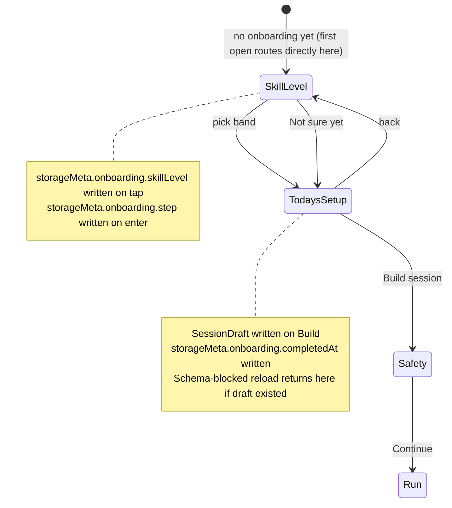
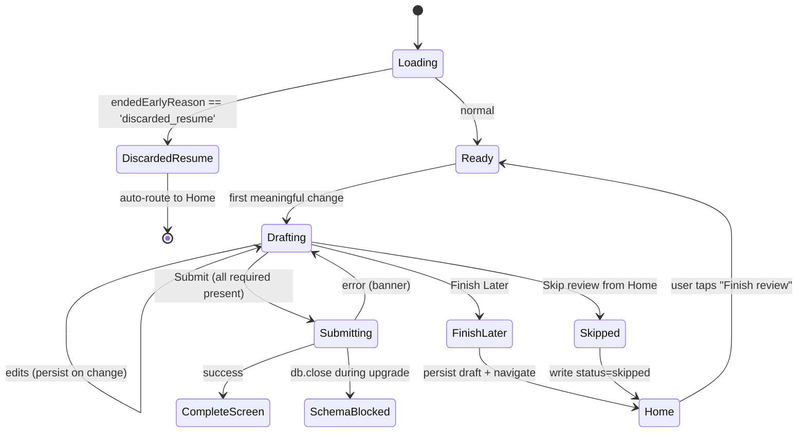
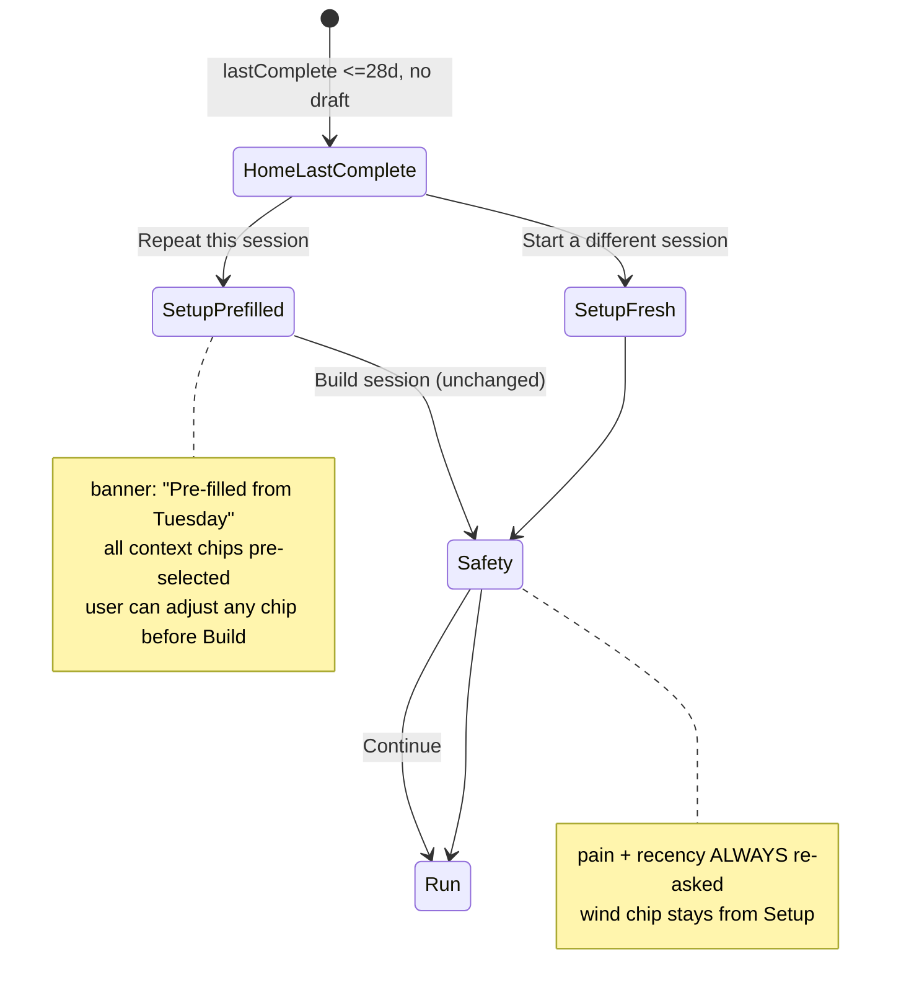

---

## id: M001-phase-c-ux
title: Phase C UX Decisions
status: draft
stage: planning
type: spec
authority: Phase C surface behavior, state precedence, copy calls, cut/defer scope, schema additions required by Phase C surfaces
summary: "Opinionated resolutions for the product + UX gaps surfaced by the pre-build review of v0b Phase C. Consolidates decisions that the existing specs leave ambiguous."
last_updated: 2026-04-19-b
depends_on:
  - docs/plans/2026-04-12-v0a-to-v0b-transition.md
  - docs/specs/m001-home-and-sync-notes.md
  - docs/specs/m001-session-assembly.md
  - docs/specs/m001-review-micro-spec.md
  - docs/specs/m001-courtside-run-flow.md
  - docs/specs/m001-adaptation-rules.md
  - docs/decisions.md
decision_refs:
  - D37
  - D41
  - D57
  - D82
  - D83
  - D86
  - D89
  - D91
  - D92
  - D93
  - D98
  - D100
  - D102
  - D103
  - D104
  - D113
  - D118
  - D119
  - D120
  - D121

# Phase C UX Decisions

## Agent Quick Scan

- This doc is the authority for Phase C surface-level behavior, state precedence, copy decisions, and cut scope. Use it together with the existing `m001-*` specs; where this doc and an older spec disagree, **this doc wins** until the older spec is updated to match.
- Phase C is the new-surfaces block of v0b. Per `D119`, v0b is the D91 field-test artifact. Phase C choices are scoped for **producing a clean D91 readout from 5 testers in 14 days**, not for shipping a fully-featured product.
- Cuts here that reduce explanation density or weekly-confidence surfaces are **D91 artifact choices**, not blanket rejection of those product directions. Post-D91 self-coached work should revisit recommendation-first reveal, visible reasoning, and the smallest accumulation layer that builds investment.
- Two things this doc does: (1) resolve the product / UX gaps surfaced by the pre-build review; (2) surface the schema additions Phase C needs so they can be bundled into a schema-first commit rather than retrofitted.

## Top-of-doc: Signed-off decisions

All eight decisions below were signed off 2026-04-16 after walk-through with the product owner. Where an older spec disagrees with a signed-off decision here, this doc wins. **Overarching UX principle**, restated from that session: *reduce cognitive overhead and load, make the app easy and a joy to use without making people think too much.* Apply this when resolving any ambiguity not explicitly covered below.

**Amendment 2026-04-16 (D121):** D-C4's Skill Level answer was revised from the `Beginner / Intermediate / Advanced` identity labels to four pair-first **functional** bands (`Foundations` / `Rally builders` / `Side-out builders` / `Competitive pair`) plus a `Not sure yet` escape. Rationale and external-evidence backing live in `D121` (`docs/decisions.md`); this doc carries the surface-level shape. Phase C-3 (Onboarding, per the consolidated plan's re-sequenced order) builds the new taxonomy.

**Amendment 2026-04-19 (Phase F Home CTA cleanup):** D-C3 and D-C5 are amended to drop the `Same as last time` text link and the `Edit` text link from the LastComplete card; the LastComplete card's secondary becomes a single `Start a different session` tertiary text link (normal case) or tertiary text link below the two Repeat buttons (ended-early case). The Draft card's `Edit` text link is renamed `Change setup`. Rationale: the shipped impl routed both `Repeat this session` and `Edit` to the same URL (`/setup?from=repeat`), and `Same as last time` was a narrow-value one-tap shortcut that bypassed the StaleContextBanner's "Adjust if today's different" nudge. The simplification preserves the Hybrid Repeat behavior of D-C3 (primary CTA → pre-filled Setup with banner → Safety → Run) while eliminating the same-URL duplication D-C5 inadvertently produced. See `docs/plans/2026-04-19-feat-phase-f-d91-validity-hardening-plan.md` Unit 1 and `D122` for the supporting D91-validity rationale.


| # | Decision | Signed-off answer |
|---|---|---|
| D-C1 | `review_pending` blocking or advisory? | **Soft block with explicit skip modal.** Home shows the Review Pending card AND the primary CTA enabled. If user taps the non-review primary CTA while a review is pending, a modal intercepts: *"You have a review pending for Tuesday's session — finish it first, or skip and continue?"* Options `[Finish review]` `[Skip and continue]`. "Skip and continue" writes the pending review with `status: 'skipped'` and proceeds to the originally-tapped flow. Modal fires at most once per pending-review instance. |
| D-C2 | V0B-11 session summary — full engine or minimum copy? | **Minimum honest copy.** Ship the 3-case copy matrix (skipped / pain / default; see Surface 5 below). Collapsed from 6→3 cases per `H10` (approved red-team fix plan v3, 2026-04-16). No `peak30` / `baseline3` / novelty-spike math in v0b. M001-build inherits the full engine and replays tester data post-hoc via V0B-15 export. |
| D-C3 | Repeat path — one-tap or pre-filled Setup? | **Hybrid (pre-filled Setup only, post-Phase-F).** LastComplete card primary CTA `Repeat this session` → pre-filled Setup with StaleContextBanner → Safety → Run. The `Same as last time` text-link one-tap path is **cut** per the 2026-04-19 Phase F amendment: the narrow one-tap saving (skipping the Setup confirm tap) was not worth bypassing the banner's "Adjust if today's different" nudge. Users certain nothing has changed still only need one tap on the pre-filled Setup's `Build Session` button. |
| D-C4 | Skill Level on first-run? | **Four pair-first functional bands + "Not sure yet" escape.** One screen, four options (`Foundations` / `Rally builders` / `Side-out builders` / `Competitive pair`) with action-anchored, pair-native descriptors, plus a "Not sure yet" text link that persists as `'unsure'`. Persist to `storageMeta.onboarding.skillLevel` as the picked enum value. No v0b code path gates on it; collected for D91 retention correlation analysis and for post-hoc replay against a richer taxonomy than identity labels. See `D121` for the taxonomy rationale and `app/src/lib/skillLevel.ts` for the shim that maps this onboarding enum onto the stable internal `PlayerLevel` drill band (`beginner` / `intermediate` / `advanced`) used by `levelMin` / `levelMax` in `app/src/data/drills.ts`. **2026-04-19 Phase F amendment + same-day D128 follow-on:** header copy is voice-aware from `storageMeta.lastPlayerMode`. **Cold-state default is solo voice** (`"Where are you today?"`) per `D128` — pair voice (`"Where's the pair today?"`) only renders when `lastPlayerMode === 'pair'` (returning pair tester). The initial Phase F cut defaulted to pair voice on cold state; D128 flipped that on founder red-team evidence that screen-one pair-voice framing misreads as "not for me" to solo users (the lead activation audience per `D5`). Band descriptors stay in functional-ability voice neutral between solo and pair. Taxonomy enum is unchanged. |
| D-C5 | Duplicate-and-edit — separate surface or folded? | **Folded into Repeat path (simplified post-Phase-F).** No separate `Edit` affordance on LastComplete; the pre-filled Setup on the Repeat path already lets users adjust any chip before Build. The LastComplete card's only secondary is `Start a different session` → fresh `/setup` (no pre-fill, no banner). The Draft card retains a secondary `Change setup` text link (renamed from `Edit` per 2026-04-19) that reopens Setup pre-filled with the current draft. Original "separate duplicate-and-edit surface" stays deferred; revisit when V0B-07 session history ships in Phase D / M001-build. |
| D-C6 | Session summary route? | **Extend CompleteScreen.** One post-session screen containing verdict + reason + metrics + save status + (optional) update banner. No new route. |
| D-C7 | `sessionRpe: -1` sentinel? | **Replace with explicit status field.** Add `status: 'submitted' \| 'skipped' \| 'draft'` on `SessionReview`; make `sessionRpe: number \| null`. Ship in the Phase C-0 schema commit before any surface work. |
| D-C8 | Home multi-state layout? | **Exactly one primary card + secondary list rows.** Precedence: `resume > review_pending > draft > last_complete > new_user`. Other active states render as compact secondary rows below the primary, never as competing primary CTAs. |

## Scope cuts and deferrals

Phase C ships the following cuts, saving implementation budget for the surfaces that move the D91 needle.


| Item                                                                                                            | Disposition                                                                                                                                                      | Rationale                                                                                      |
| --------------------------------------------------------------------------------------------------------------- | ---------------------------------------------------------------------------------------------------------------------------------------------------------------- | ---------------------------------------------------------------------------------------------- |
| V0B-11 full reason-trace engine (`peak30`, `curr14/prev14`, novelty-spike detection, drill-variant aggregation) | **Deferred to M001-build.** v0b ships only Conservative-bootstrap `hold` + `N alongside %`.                                                                      | Cannot meaningfully fire in a 14-day / 2-session cohort (D-C2).                                |
| Session history surface (session list, filter, search)                                                          | **Deferred to Phase D.** Already V0B-07.                                                                                                                         | Not needed for the D91 second-session path; Repeat from LastComplete covers the shortest path. |
| Duplicate-and-edit as a separate entry point                                                                    | **Folded into Repeat path.**                                                                                                                                     | Redundant with LastComplete + pre-filled Setup (D-C5).                                         |
| Multi-nudge / scheduled-prompt logic for Finish Later                                                           | **Dropped.** Ship one badge on Home, no time-based re-prompts.                                                                                                   | Spec says "prefer one later nudge." Literal implementation is a badge.                         |
| Push notifications for deferred sRPE window                                                                     | **Not in scope.** PWA platform constraint and not called for by the spec.                                                                                        | iOS PWA notifications are limited and unreliable; mobile Safari requires install anyway.       |
| "Switch to solo/pair fallback" as a Home-level action                                                           | **Folded into Setup re-entry.** Home's Draft card gets a "Change setup" secondary (renamed from "Edit" per Phase F 2026-04-19) that opens Setup pre-filled; changing player mode there naturally rebuilds the draft. | Spec lists the action but no surface; Setup is the natural place.                              |
| `SessionPlan.context.setWindowPlacement` (V0B-14) UI                                                            | **Deferred until V0B-14 lands.** V0B-14 itself is a Phase D polish item.                                                                                         | Schema reservation only (see schema changes below).                                            |


## Schema additions (to bundle with Phase A or ship as a Phase C prerequisite commit)

Phase C needs these fields/tables. All are optional or additive, so no Dexie version bump if we land them with Phase A — otherwise they need one version bump.


| Field / table                                                                          | Where                  | Purpose                                                                                                                                                                                           | Red-team source                                   |
| -------------------------------------------------------------------------------------- | ---------------------- | ------------------------------------------------------------------------------------------------------------------------------------------------------------------------------------------------- | ------------------------------------------------- |
| `storageMeta` table (key-value)                                                        | `app/src/db/schema.ts` | Stores `onboarding.skillLevel` (D-C4 / D121 enum), `onboarding.completedAt`, `onboarding.step` (crash-safe first-run resume key), `ux.softBlockDismissed.{execId}` (A7 soft-block modal dismissal; cleaned up on terminal-review write). Key-value keeps it flexible without schema churn. **Cut:** `ux.staleDraftLastWarnedAt` (age tiers dropped per C5), `banner.safariToHswaDismissedAt` (V0B-27 cut per H12). | Flow E1, E5, E8, D-C4, D121                        |
| `SetupContext.wind?: 'calm' | 'light' | 'strong'`                                      | `app/src/db/types.ts`  | D93 captures wind at session start; currently missing from the schema.                                                                                                                            | Flow gap, D93                                     |
| `SessionReview.status: 'submitted' | 'skipped' | 'draft'`                              | `app/src/db/types.ts`  | Replaces the `sessionRpe: -1` sentinel. `draft` is reserved for live-write review persistence in Phase C.                                                                                         | D-C7, Flow E9                                     |
| `SessionReview.sessionRpe` becomes `number | null`                                     | `app/src/db/types.ts`  | Pairs with `status`. `null` when `status !== 'submitted'`. **Landed** (working tree already has this).                                                                                           | D-C7                                              |
| `SessionDraft.rationale?: string`                                                      | `app/src/db/types.ts`  | One-sentence human-readable reason for why this session was assembled, emitted by `buildDraft()`. **v0b: schema only** — the "See why" UI affordance and "What changes next time" Repeat-card line are **cut** per approved red-team fix plan (`H7`, 2026-04-16). Field stays for forward-compat so M001-build can light up the UI without a migration. `buildDraft()` emits `undefined` in v0b (no stub string, per GD37). | Design gap, m001-session-assembly.md calls for it |

**Cut from Phase C schema** (per approved red-team fix plan v3):

- `SessionReview.reviewTiming` — derive at export/readout time from `submittedAt - ExecutionLog.completedAt` (C4).
- `SessionPlan.context.setWindowPlacement` — ships with V0B-14 if it lands post-D91; Dexie doesn't need pre-declaration for optional fields (C3).
- `ux.staleDraftLastWarnedAt` in `storageMeta` — age tiers cut (C5).
- `banner.safariToHswaDismissedAt` in `storageMeta` — V0B-27 cut (H12 / C16).


All additions are optional or nullable. No Dexie version bump required if they ride with Phase A's existing landed schema — the rows just get wider. The `storageMeta` table is new; that does require a version bump. Recommend doing a single migration that lands `storageMeta` + all the above shape changes as one new Dexie version, early in Phase C before surfaces build on them.

## Surface resolutions

Per-surface decisions, flows, and wireframes. Each section assumes the top-of-doc sign-offs.

### Surface 1 — Onboarding (Skill Level → Today's Setup)

**Decisions** (H9 2026-04-16 — Home/NewUser screen cut; onboarding is now two screens):

- Two screens: `Skill Level` → `Today's Setup`. First-open routes directly to Skill Level with a one-line preamble *"Welcome. Let's get you started."* above the existing *"Where's the pair today?"* heading. Home/NewUser as a standalone welcome screen was cut per H9 — a content-free screen on the thesis-critical first interaction is pure visual debt.
- **Skill Level options (pair-first functional bands, D-C4 / D121):** four action-anchored options plus a "Not sure yet" text link.
  - `Foundations` — "We can keep a friendly toss alive, but easy serves and full three-contact sequences are still inconsistent."
  - `Rally builders` — "We can pass an easy serve or toss, set a hittable ball some of the time, and keep short rallies going."
  - `Side-out builders` — "We usually pass to a target, set with intention, and attack or place the third ball under moderate pressure."
  - `Competitive pair` — "We handle tougher serves, keep first and second contact quality steady, and make purposeful attack choices in game-like rallies."
  - `Not sure yet` — text link; persists `'unsure'` and the session builder treats the user as `Foundations` for assembly purposes until they change it.
  - Solo users see the same four labels, read in the singular ("I can keep a friendly toss alive…"). Phrasing is auto-swapped by `playerCount`; the enum is shared so that swapping between solo and pair sessions later never forces a re-pick.
- **Rendered label vs persisted enum.** Persist the short machine enum (`foundations` / `rally_builders` / `side_out_builders` / `competitive_pair` / `unsure`) to `storageMeta.onboarding.skillLevel`. Never persist the long helper sentence; it's copy only and will evolve.
- **Internal drill band stays stable.** `app/src/data/drills.ts` keeps its existing `PlayerLevel` enum (`beginner` / `intermediate` / `advanced`) on `levelMin` / `levelMax`. The onboarding enum maps onto that band via `skillLevelToDrillBand()` in `app/src/lib/skillLevel.ts`. This decouples the user-facing taxonomy from the drill-metadata taxonomy so either can evolve without a data migration.
- **Resume semantics:** persist `storageMeta.onboarding.step` on every tap (value is `'skill_level'` or `'todays_setup'`). Tab close on Skill Level → return to Skill Level. Onboarding is complete when `SessionDraft` is written AND `storageMeta.onboarding.completedAt` is set.
- **Back behavior:** no back arrow on Skill Level (first-open = no prior screen). Today's Setup has a back arrow to Skill Level.
- **Backfill migration (H15 defense-in-depth):** On first v4 open, if any `ExecutionLog` exists AND `onboarding.completedAt` is absent, backfill `onboarding.completedAt = Date.now()`. Prevents existing testers from being routed through onboarding mid-cycle if deployment sequencing slips.
- **Wind** lives on Today's Setup as a 3-chip row (`Calm` / `Light wind` / `Strong wind`), default `Calm`.

**State machine.**




**Wireframe — Skill Level screen (pair mode; solo swaps "We" → "I" on the descriptors).**

```
┌───────────────────────────────────────┐
│                                       │
│  Welcome. Let's get you started.      │  ← 14px preamble (first-open only)
│                                       │
│  Where's the pair today?              │  ← 20px bold (pair)
│                                       │  ← "Where are you today?" if solo
│  You can change this later.           │  ← 14px secondary
│                                       │
│  ┌─────────────────────────────────┐  │
│  │ Foundations                     │  │
│  │ Keeping a friendly toss alive.  │  │
│  └─────────────────────────────────┘  │
│                                       │
│  ┌─────────────────────────────────┐  │
│  │ Rally builders                  │  │
│  │ Pass easy serves, short rallies.│  │
│  └─────────────────────────────────┘  │
│                                       │
│  ┌─────────────────────────────────┐  │
│  │ Side-out builders               │  │
│  │ Pass to target, attack the 3rd. │  │
│  └─────────────────────────────────┘  │
│                                       │
│  ┌─────────────────────────────────┐  │
│  │ Competitive pair                │  │
│  │ Tougher serves, game-like play. │  │
│  └─────────────────────────────────┘  │
│                                       │
│          Not sure yet                 │  ← 14px text link
│                                       │
└───────────────────────────────────────┘
```

Each option is a full-width button ≥60px tall with a short label + one-sentence functional descriptor. Tap writes the enum and advances. The descriptor is shorter than the long helper sentences above — those live only in the D-C4 decision row as the canonical anchors and may be reflowed into a short inline expander in later passes; v0b ships the short version above to keep the screen glanceable.

**Copy.** Heading: "Where's the pair today?" in pair mode, "Where are you today?" in solo mode. Sub: "You can change this later." Escape link: "Not sure yet". Keep the screen warm, non-comparative, and action-anchored; do not introduce "good," "advanced," "club AA," or other identity labels.

**Explicitly out of v0b (per D121 scoping):**

- No secondary "about even / one newer / one stronger" pair-differential question. Capture shape, engine rule (`lower-of-two` complexity ceiling), and the optional pair-differential follow-up are reserved for M001-build; see `docs/specs/m001-adaptation-rules.md` → *Pair complexity ceiling (reserved)* and the open-items list below.
- No per-drill skill-band picker, no "my level vs partner's level" split, no slider.
- No numeric labels. The four bands are intentionally non-numeric: beach volleyball amateur ratings lack the shared social meaning that NTRP (tennis) or DUPR (pickleball) have, so a numeric scale would invite comparison without improving the deterministic engine's starting archetype.

### Surface 2 — Home screen (multi-state with precedence)

**Decisions** (simplified per v3 red-team fix plan — flat 4-row precedence, no age branching).

- Primary card follows strict precedence: `resume > review_pending > draft > last_complete > new_user`. Exactly one primary card; other active states render as secondary list rows.
- Review Pending is **advisory** (D-C1): the Draft or Start CTA stays clickable; ReviewPending is a card that can be dismissed ("Skip review") or acted on ("Finish review"). Soft-block modal fires once per pending-review instance (A7) with dismissal keyed off `storageMeta.ux.softBlockDismissed.{execId}`; key is deleted on terminal-review write.
- **Multi-pending-review UI: cut** (C6). `findPendingReview()` already returns newest-only; subsequent pending reviews surface naturally after the newest is resolved.
- **Aged-draft tiers (`>7d` / `>21d`) cut** (C5). Unreachable in the 14-day D91 window.
- **Aged-LastComplete `>28d Welcome back` tier cut** (H11 / C15). Same reason; seasonal returners are M001-build scope.
- **NewUser state** routes directly to Skill Level on tap (no Home/NewUser welcome screen — H9).

**Precedence table (flat 4-row).**

| resume? | review_pending? | draft? | last_complete? | Primary                     | Secondary rows                        |
| ------- | --------------- | ------ | -------------- | --------------------------- | ------------------------------------- |
| Y       | *               | *      | *              | Resume                      | everything else muted                 |
| N       | Y               | N      | N              | Finish Review               | —                                     |
| N       | Y               | Y      | *              | Finish Review (advisory)    | Draft (Start), optional LastComplete  |
| N       | Y               | N      | Y              | Finish Review (advisory)    | LastComplete (Repeat)                 |
| N       | N               | Y      | *              | Draft (Start)               | LastComplete (Repeat) if also present |
| N       | N               | N      | Y              | LastComplete (Repeat)       | —                                     |
| N       | N               | N      | N              | **"Start first workout"** (routes to Skill Level per C-3) | — |


**Wireframe — Home with stacked priority (post-Phase-F, 2026-04-19).**

```
┌─────────────────────────────────┐
│ 🏐  Volleycraft                 │
├─────────────────────────────────┤
│ [UPDATE READY banner if any]    │  ← V0B-20, safe-boundary only
├─────────────────────────────────┤
│                                 │
│  PRIMARY CARD (exactly one)     │
│  ┌───────────────────────────┐  │
│  │ Your last session         │  │  ← example: LastComplete primary
│  │ Open Sand · 25 min · 2d   │  │
│  │ Keep building             │  │  ← reason carried forward
│  │                           │  │
│  │  [Repeat this session]    │  │  ← primary CTA, 54-60px
│  │                           │  │
│  │  Start a different session│  │  ← tertiary text link
│  └───────────────────────────┘  │
│                                 │
├─ secondary rows (if active) ───┤
│                                 │
│  • 1 review pending · Tuesday  │
│    [Finish review]              │
│                                 │
│  • Draft: 40 min session (9d)  │
│    [Open] [Discard]             │
│                                 │
├─────────────────────────────────┤
│ "Saved on this device" · footer │
└─────────────────────────────────┘
```

**Copy (post-Phase-F, 2026-04-19 amendment).**

- NewUser primary: "Ready for your first session? · 3 minutes of setup, then ~15 min on sand." / "Start first workout" (tap routes to Skill Level per C-3)
- Resume primary: "You were mid-session · Block N of M · paused 5 min ago" / "Resume" / "Discard"
- Review Pending primary: "Review your last session · Tuesday" / "Finish review" / "Skip review"
- Draft primary: "Today's suggestion · Open Sand · 25 min · Keep building from last session" / "Start session" / "Change setup" (text link)
- LastComplete primary (normal): "Your last session · Open Sand · 25 min · 2 days ago" / "Repeat this session" / "Start a different session" (text link)
- LastComplete primary (ended-early): "Your last session · Open Sand · ended at 14 min (of 25 planned) · 2 days ago" / "Repeat full 25-min plan" / "Repeat what you did (14 min)" / "Start a different session" (text link)
- **Cut copy variants** (age tiers + multi-pending count): aged-draft subtext, `>28d Welcome back`, "N reviews pending." Cut per v3 H11 / C5 / C6.
- **Cut by Phase F (2026-04-19):** LastComplete `Edit` text link (folded into Repeat's pre-filled Setup), LastComplete `Same as last time` text link (bypassed StaleContextBanner; one-tap saving not worth the data-quality regression). Draft `Edit` text link renamed to `Change setup`.

**Rationale for Phase F simplification.** The pre-Phase-F impl shipped `Repeat this session` (primary) and `Edit` (text link) both routing to `/setup?from=repeat` — two affordances with identical behavior. `Same as last time` was a third text link that bypassed Setup entirely (one tap saved, but at the cost of bypassing the StaleContextBanner's "Adjust if today's different" nudge). The post-Phase-F card simplifies to a single user-visible choice — *same as last time, or different?* — with no same-URL duplication and no shortcut that dodges the "what changed today?" check. See `docs/plans/2026-04-19-feat-phase-f-d91-validity-hardening-plan.md` Unit 1.

**State transitions.** Dismissing a secondary row triggers a fade-and-collapse (150ms) rather than instant disappearance. Primary card swaps after a dismissal use a crossfade; avoid hard cuts.

**Accessibility.** Primary card has `role="region"` with `aria-label` describing the state ("Primary action: resume session"). Secondary list is a `<ul>` with `role="list"` and items as `<li>`. Update banner uses `aria-live="polite"`.

### Surface 3 — Session assembly (no Session Prep)

**Decisions.**

- There is **no Session Prep screen**. `Setup` builds the `SessionDraft`, writes it to Dexie, and routes straight to `Safety`. Same as v0a.
- **Swap / Shorten / Switch affordances** live on the Home/Draft card's `Change setup` flow (renamed from `Edit` per Phase F 2026-04-19), which re-enters `Setup` with pre-filled values and offers per-block swap affordances once the draft exists. Not a new screen. LastComplete no longer carries a separate `Edit` secondary — the single `Start a different session` secondary routes to fresh Setup instead; modifying last-session context happens through the Repeat path's pre-filled Setup.
- `buildDraft()` emits a `rationale: string` on the `SessionDraft` — **v0b: schema-only** (`H7`). The "See why" affordance on Home/Draft and the Repeat card's "What changes next time" line are cut; the field stays for M001-build to light up without a schema migration.
- **Per-block swap** in Setup (not a new screen): after building a draft, the Home/Draft card shows the block list with a single `Swap` affordance per block. Tapping cycles to the next ranked alternative. This is `2-3 swap alternatives` from the session-assembly spec, rendered compactly.
- **Fallback / broaden constraints:** if `buildDraft` returns an empty or near-empty draft, the Setup screen shows an inline "Can't build for these constraints — broaden?" affordance that relaxes one filter at a time (net required → optional, wall required → optional). No new screen.

**Handoff.** `Setup` → `Safety` → `Run`. The `Start` button on `Safety` is the lock boundary (D37: the plan snapshot locks at session start, not at draft build). This matches current v0a behavior.

**Copy.**

- Rationale one-liner examples: "Built for solo sand, 15 min, keep building from last time." / "Built for solo net, 25 min, light wind."
- Swap affordance: "Swap: [current drill] · [alternative] · [alternative]" (tap to cycle).
- Broaden constraints: "These settings don't leave many options · Broaden constraints" (one-tap).

### Surface 4 — Review + Finish Later + deferred sRPE

**Decisions.**

- **Finish Later** ships as a secondary button on the Review screen. Tapping persists partial review fields as a `SessionReview` row with `status: 'draft'` and navigates to Home where the Review Pending card surfaces.
- **Deferred sRPE:** no pop-up, no scheduled nudge. The user returns via Home. The review screen looks the same on re-entry; if `completedAt` is >30 min in the past, sRPE capture is allowed but `reviewTiming` stores as `immediate` (we lost the window) or `delayed` (we got it in-window). Compute from `submittedAt - log.completedAt`; persist explicitly.
- `**notCaptured`** escape hatch ships for the skill metric: one tap below the counter labeled "Couldn't capture reps this time." Writes `goodPasses: 0, totalAttempts: 0` with a `quickTag: 'notCaptured'`.
- **Discarded-resume sessions** (`endedEarlyReason === 'discarded_resume'`) skip the review screen entirely and route straight to Home. Writing a review for a session that ended before it started is user-hostile.
- **Review draft persistence:** write the review row as `status: 'draft'` on first meaningful change (first tap on sRPE, or first counter increment, or first text input in the note). Overwrite on every subsequent change. On Finish Later or schema-blocked reload, the draft survives.
- **Partial session + Finish Later:** Finish Later allowed even without `incompleteReason`. Only `Submit` requires it.
- **Skipped review:** writes `SessionReview { status: 'skipped', sessionRpe: null, goodPasses: 0, totalAttempts: 0, submittedAt }`. No sentinel.

**State machine.**




**Copy.**

- Finish Later button: "Finish later".
- Home re-entry card: "Review your last session · Tuesday" / "Finish review" / "Skip review"
- notCaptured escape: "Couldn't capture reps this time"
- Skipped review confirmation: "Review skipped · next session will stay at the same level"

### Surface 5 — Session Summary with minimum-honest-copy reason trace (extends CompleteScreen)

**Decisions per D-C2 + D-C6.**

- The summary renders on **CompleteScreen** (same route as today). No new route.
- v0b ships with **one verdict and one reason family only: `hold`** plus a forward-looking bootstrap note. No `progress`, no `deload`, no novelty-spike path, no drill-variant aggregation, no phase detection beyond the bootstrap-or-not flag.
- **Surface vocabulary (D121):** the internal enum stays `progress` / `hold` / `deload`; the user-facing primary card uses softer, action-anchored labels — `Step up next time` / `Keep building` / `Lighter next`. v0b only renders the `hold` branch, so the only label live on this surface is **`Keep building`** (pair mode) or the solo-singular variant. The older "Holding level next time" string is retired in favor of `Keep building` on all five v0b copy cases below.
- **Bootstrap detection:** treat any user with `< 3` submitted (`status === 'submitted'`) reviews OR `< 14 days` of review history as bootstrap. Compute at summary-render time; it's cheap.
- **Low-N floor:** if the review's `totalAttempts < 50` AND the user has scored contacts, display "Not enough reps yet to trust the rate — keep going." This is the V0B-13 `N alongside %` honesty rule surfaced as copy.
- **Layout:** inverted-pyramid. Verdict largest, plain-prose reason below, metrics below that.
- **D86 compliance:** no "spike," no "overload," no "injury risk," no red. Verdict icon is a neutral equal sign or steady-state glyph, not a warning.
- **Save status (V0B-24 three-state copy per D118)** renders below the summary verdict as it does today.
- **AI slop rule:** no LLM in this surface. Template composition from a fixed copy table. If an implementer reaches for an LLM to "make it sound natural," that is a spec violation.

**Wireframe — CompleteScreen extended with summary (pair mode; solo swaps "pair" language).**

```
┌─────────────────────────────────┐
│ Safety icon                     │  ← existing header, subtle
├─────────────────────────────────┤
│ Today's pair verdict            │  ← small section header (pair mode);
│                                 │    "Today's verdict" in solo mode
│         ⏸  (neutral)            │  ← verdict icon, not warning
│                                 │
│        Keep building            │  ← 28-32px bold, VERDICT FIRST
│                                 │
│   Early sessions — we'll start  │  ← 14px, forward-looking prose
│   trusting the trend after a    │
│   few more.                     │
│                                 │
├─────────────────────────────────┤
│ Session recap                   │  ← small section header
│ Open Sand · 25 min              │
│ Blocks: 5/6 completed           │
│ Good passes: 18 (72%)           │  ← N alongside % per V0B-13
│ Effort: Moderate (5)            │
├─────────────────────────────────┤
│ [UPDATE READY banner if any]    │  ← V0B-20, dismissable
├─────────────────────────────────┤
│ ✓ Saved on this device          │  ← V0B-24 three-state copy
│ Stored locally in the           │
│ installed app. Not backed up    │
│ unless you enable sync/export.  │
├─────────────────────────────────┤
│  [Done]                         │
└─────────────────────────────────┘
```

**Copy matrix (v0b-complete, 3 cases per H10).**

Headline above the verdict icon is posture-sensitive:

- `SessionPlan.playerCount === 2` → "Today's pair verdict"
- `SessionPlan.playerCount === 1` → "Today's verdict"

The verdict + reason lines themselves are identical across solo and pair for v0b (the `hold` reasons are pair-agnostic). Pair mode adds only the section header; no pair-averaged metrics, no split view, consistent with `D120` and the pair-collective verdict stance in `D121`.


| Case                        | Condition                                             | Verdict line      | Reason line                                                                             |
| --------------------------- | ----------------------------------------------------- | ----------------- | --------------------------------------------------------------------------------------- |
| Bootstrap — first session   | user's 1st submitted review                           | "Keep building"   | "Learning your baseline — we'll start tuning after a few more sessions."                |
| Bootstrap — 2nd/3rd session | 2 or 3 submitted reviews in <14 days                  | "Keep building"   | "Early sessions — we'll start trusting the trend after a few more."                     |
| Bootstrap + low-N floor     | bootstrap AND totalAttempts < 50 with scored contacts | "Keep building"   | "Not enough reps yet to trust the rate — keep going. ({N} scored passes this session.)" |
| Skipped review              | status == 'skipped'                                   | "No change"       | "No review this time — next session stays at the same level."                           |
| End-early + pain reason     | status == 'submitted' AND incompleteReason == 'pain'  | "Lighter next"    | "You stopped early with pain — next session will be gentler to let things settle."      |


Post-v0b — full `progress` / `hold` / `deload` decision table lands with the full engine in M001-build. v0b deliberately does not render any copy in those branches because they don't fire. When it does, `progress` surfaces as `Step up next time`, `hold` as `Keep building`, and `deload` as `Lighter next`, per `D121` surface vocabulary; the internal enum names stay unchanged.

**Accessibility.** Verdict line has `aria-live="polite"` and is the element the screen-reader lands on. Icon has `aria-hidden="true"` because the verdict word carries the meaning. Metrics use a definition list (`dl/dt/dd`) as today.

### Surface 6 — Repeat path (from Home/LastComplete)

**Decisions per D-C3.**

- "Repeat this session" routes to **Setup pre-filled** with the last session's context, then through Safety → Run. Not one-tap to Run.
- **If `lastComplete.status === 'ended_early'`:** show both "Repeat what you did (14 min)" and "Repeat full plan (25 min)" as primary/secondary. Default primary is "Repeat full plan" because it matches the user's original intent (D37 plan-locking).
- **Stale-context mitigation:** on the Repeat CTA tap, pre-filled Setup loads with a visible "Setup pre-filled from Tuesday. Adjust if today's different." banner. Catches solo-vs-pair drift and wind changes.
- **Safety answers are NEVER pre-filled** (D83 invariant): pain flag and recency are always re-asked. This is per-session safety; there is no safe way to cache it.
- **Age >28d branching: cut** (H11 / C15). Flat precedence applies at all ages; the 14-day D91 window can't produce `>28d` records and the seasonal-returner concern is M001-build scope.

**State machine.**




**Wireframe — LastComplete primary card (normal case, post-Phase-F 2026-04-19).**

```
┌───────────────────────────────────┐
│ Your last session                 │
│ Open Sand · 25 min · 2 days ago   │
│ 72% good passes (18 of 25)        │
│                                   │
│ Next time: keep building          │  ← forward guidance from summary
│                                   │
│  [Repeat this session]            │  ← primary → /setup?from=repeat
│                                   │    (pre-filled + StaleContextBanner)
│  Start a different session        │  ← tertiary text link → /setup
│                                   │    (fresh, no pre-fill, no banner)
└───────────────────────────────────┘
```

**Wireframe — LastComplete with ended_early case (post-Phase-F 2026-04-19).**

```
┌───────────────────────────────────┐
│ Your last session                 │
│ Open Sand · ended at 14 min       │
│ (of 25 planned) · 2 days ago      │
│                                   │
│  [Repeat full 25-min plan]        │  ← primary (matches user's intent)
│  [Repeat what you did (14 min)]   │  ← outline secondary
│                                   │
│  Start a different session        │  ← tertiary text link → /setup (fresh)
└───────────────────────────────────┘
```

**Cut by Phase F (2026-04-19):** `Edit` text link on LastComplete (was redundant with Repeat — same `/setup?from=repeat` URL), `Same as last time` text link (was a narrow one-tap shortcut that bypassed the StaleContextBanner's "Adjust if today's different" nudge — the data-quality regression outweighed the one-tap saving).

## Contract tests to add

These are invariants the test suite must protect as Phase C ships.


| Test                                                                                      | Assertion                                                                                           | Why                                                                         |
| ----------------------------------------------------------------------------------------- | --------------------------------------------------------------------------------------------------- | --------------------------------------------------------------------------- |
| `UpdatePrompt` never renders on `/setup`, `/safety`, `/run`, `/transition`, `/review`     | Extend the existing `update-prompt-boundary.test.ts` static guard                                   | D41 safe-boundary policy (already in place; confirm extends to new screens) |
| `SessionReview.sessionRpe` is always `null` OR in `[0, 10]`                               | Unit test + type-level refinement                                                                   | D-C7 replaces the `-1` sentinel                                             |
| `SessionReview.status === 'submitted'` implies `sessionRpe` is a number                   | Unit                                                                                                | D-C7                                                                        |
| `SessionReview.status === 'skipped'` implies `sessionRpe === null` and `goodPasses === 0` | Unit                                                                                                | D-C7                                                                        |
| Home primary card is exactly one at a time                                                | Component integration test with every state combination from the precedence table                   | D-C8                                                                        |
| Multiple pending reviews surface a count, not just the newest                             | Unit on `findPendingReview` (or its replacement) + Home component test                              | Flow E2                                                                     |
| Finish Later persists review draft                                                        | Unit on review service + component test                                                             | Surface 4                                                                   |
| Schema-blocked reload preserves onboarding progress                                       | Unit — call `emitSchemaBlocked`, verify `storageMeta.onboarding.step` is readable after mock-reload | Flow E8                                                                     |
| Discarded-resume sessions bypass review                                                   | Component test: render `/review?id=…` for a discarded-resume log, assert route to Home              | D-C flow + Flow E3                                                          |
| Session summary never renders `undefined` or `—` for any case                              | Property test over the 3-case copy matrix (H10)                                                      | Surface 5                                                                   |


## Open items to brainstorm (not blocking Phase C start)

These are not critical-path for Phase C implementation but worth picking up in parallel or early Phase D:

- Session Summary copy for `progress` and `deload` verdicts — deferred to M001-build but a copy draft should happen before then to avoid writing it under pressure. Target vocabulary is `Step up` / `Keep building` / `Lighter next` on the primary card, per D121 surface labels; internal enums stay `progress` / `hold` / `deload`.
- Duplicate-last behavior when a drill has been removed from the catalog (Flow E13). A simple substitute-or-refuse rule is fine; pick one.
- Pair-fallback Home action — where does it live if not on Home? Probably Setup; confirm.
- ~~`See why this session was chosen` rationale surface~~ — **cut from v0b** per `H7` (approved red-team fix plan, 2026-04-16). The `SessionDraft.rationale` schema field stays; the UI treatment is M001-build scope.
- ~~Safari → HSWA banner placement (V0B-27)~~ — **V0B-27 cut** per H12 / C16 (approved red-team fix plan v3, 2026-04-16). 5-tester concierge handles the corner case via install instructions + founder contact.
- Transition animations — nice-to-have, not blocking.
- **Pair-differential follow-up (deferred to M001-build, per D121).** Optional secondary question after the pair-first skill band: "How even is the pair right now? · about even · one a step newer · one a step stronger". Shape, engine rule (bias rep allocation toward the newer player when a gap is declared), and the downstream "who should the app bias easier reps toward?" follow-up are all deferred. v0b captures only the band; D91 cohort evidence should decide whether the differential question earns its screen time.

## Summary of what Phase C now looks like after this decision pass

Before this pass, Phase C was scoped to the list in the transition plan with several load-bearing ambiguities. After:

**What stays:**

- Full onboarding (3 screens, crash-safe, with Skip on Skill Level)
- Home priority model (precedence table, multi-flag with secondary list)
- Constrained template assembly (Setup + per-block Swap; no new screen)
- Full review contract (Finish Later, deferred sRPE, draft persistence, status field)
- Session summary (minimum-honest-copy on CompleteScreen, **3-case matrix** per H10)
- Repeat path (pre-filled Setup, ended-early branching)

**What's cut or deferred:**

- V0B-11 full reason-trace engine → M001-build
- Duplicate-and-edit as separate surface → folded into Repeat
- Session history surface → V0B-07 in Phase D
- Scheduled / multi-nudge prompts for Finish Later
- Push notifications for deferred sRPE

**What's new schema that needs to land first:**

- `storageMeta` table
- `SessionReview.status` + `sessionRpe` nullability
- `SessionReview.reviewTiming`
- `SetupContext.wind`
- `SessionPlan.context.setWindowPlacement` (reserved, no UI)
- `SessionDraft.rationale`

**Implementation sequencing:** owned by [`docs/plans/2026-04-16-003-rest-of-v0b-plan.md`](../plans/2026-04-16-003-rest-of-v0b-plan.md) §3. The consolidated plan re-sequences sub-phases by product risk (review and summary land before onboarding and home priority). This spec owns the product decisions and copy; it does not own execution order.

## Related docs

- `docs/plans/2026-04-12-v0a-to-v0b-transition.md` — overall v0b sequencing
- `docs/specs/m001-home-and-sync-notes.md` — Home states + save copy (extends)
- `docs/specs/m001-session-assembly.md` — assembly model (extends)
- `docs/specs/m001-review-micro-spec.md` — review fields + flow (extends)
- `docs/specs/m001-courtside-run-flow.md` — run flow (Session Prep section needs D98 update, flagged in Pass 1)
- `docs/specs/m001-adaptation-rules.md` — engine inputs that v0b's summary and schema feed
- `docs/decisions.md` — especially D91, D98, D100, D104, D113, D118, D119, D120, D121
- `app/src/lib/skillLevel.ts` — shim that maps the onboarding skill band (D-C4 / D121) onto the internal `PlayerLevel` drill band used by `app/src/data/drills.ts`

