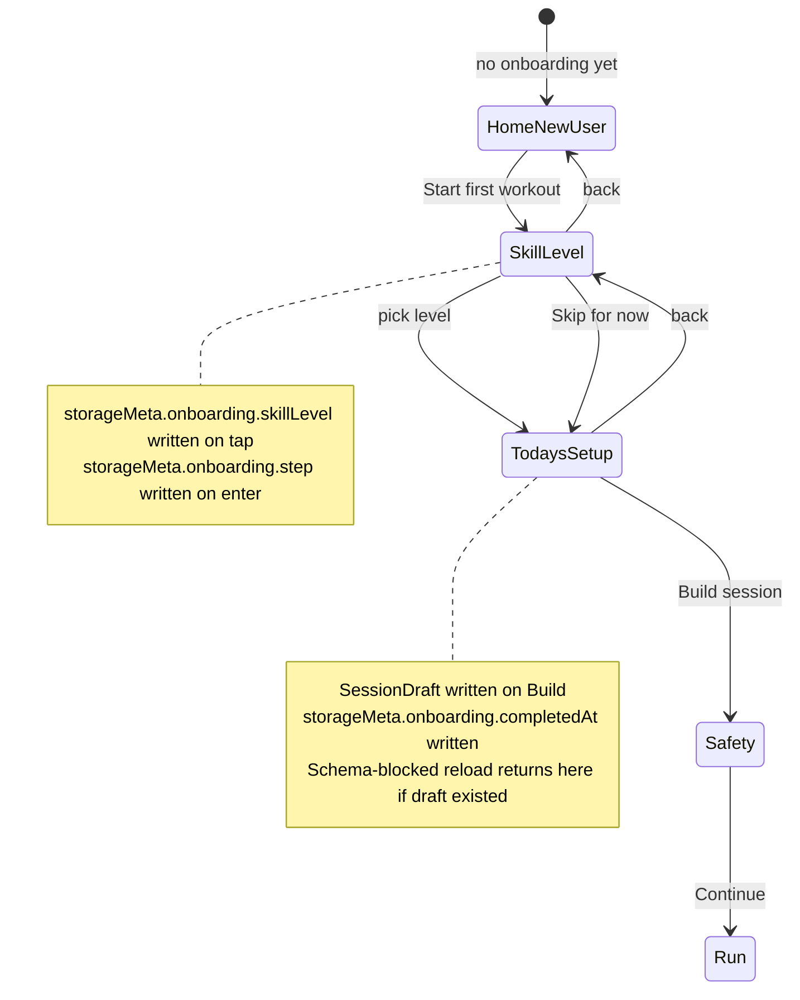
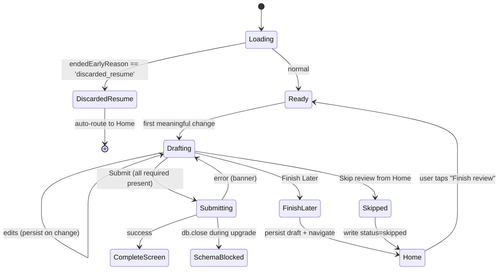
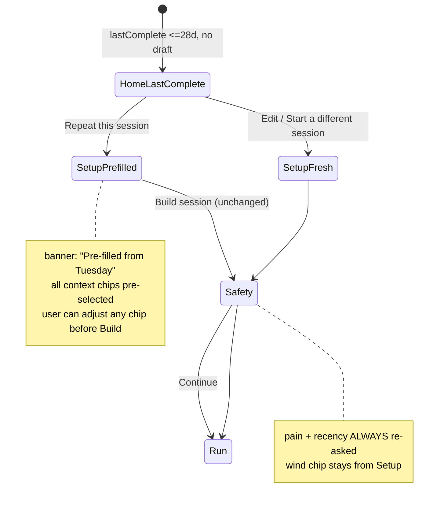

# Phase C UX Decisions

## Agent Quick Scan

- This doc is the authority for Phase C surface-level behavior, state precedence, copy decisions, and cut scope. Use it together with the existing `m001-*` specs; where this doc and an older spec disagree, **this doc wins** until the older spec is updated to match.
- Phase C is the new-surfaces block of v0b. Per `D119`, v0b is the D91 field-test artifact. Phase C choices are scoped for **producing a clean D91 readout from 5 testers in 14 days**, not for shipping a fully-featured product.
- Two things this doc does: (1) resolve the product / UX gaps surfaced by the pre-build review; (2) surface the schema additions Phase C needs so they can be bundled into a schema-first commit rather than retrofitted.

## Top-of-doc: Decisions needing your sign-off

These are the decisions the automated reviews converged on as non-trivial. I've written opinionated defaults below; if you push back on any of them, the rest of the doc realigns.

| # | Decision | Default answer | Rationale | Risk if wrong |
|---|---|---|---|---|
| D-C1 | Is `review_pending` a **blocking** Home state or an **advisory badge**? | **Advisory badge.** User can always start a new session; the review prompt stays visible until either submitted or explicitly skipped. | `D91` measures second-session starts. Blocking on review is the single most obvious kill-floor for the gate. | **High.** Blocking would actively undermine D91. Advisory is also closer to the spec's "prefer one later nudge" language. |
| D-C2 | Does **V0B-11 session summary** ship the full reason-trace engine or a minimum-honest-copy pass? | **Minimum honest copy.** A 14-day, 2-session cohort cannot exit Conservative bootstrap, so the full engine renders the same `hold: bootstrap` message every time. Ship: (a) always-`hold` with bootstrap copy, (b) the `N alongside %` honesty rule (V0B-13) on metrics, (c) no novelty-spike or overshoot logic. | Full engine is ~1 week of work for messages that cannot fire in the cohort window. | Medium. We lose the ability to show `progress` / `deload` on a tester who beats the cohort (unlikely but possible). Mitigation: the full engine lands in M001-build anyway and is free to replay any tester's logs through the finished rules post-hoc via V0B-15 export. |
| D-C3 | Is the **repeat path** a one-tap home → run flow, or pre-filled Setup → Safety → Run? | **Pre-filled Setup.** The user still sees and can adjust Today's Setup; only the chip values are pre-selected. One more tap but catches "I'm solo today, not paired" context drift. | Courtside reality diverges from last-session context more often than the "near zero-config" framing implies. Pre-filled Setup stays one adjustment away from being pure one-tap for users whose context hasn't changed. | Low. If users resent the extra tap, it's a Phase D polish to add a "Same as last time" fast path on the Home card. |
| D-C4 | Does **Skill Level** ship as a first-run screen, and where is it persisted? | **Ship it, persist in `storageMeta`, but do NOT gate on it.** Defaults: `beginner` if unanswered. If no v0b code path currently reads it, ship the screen anyway (O11 data collection is cheap) but implement a one-tap "Skip for now" secondary action and don't block Setup on it. | The field-test wants to learn whether testers provide a skill level and whether it correlates with retention. Zero-consumer-but-collected is fine for one surface; blocking for a phantom input is not. | Low-Medium. If the user skips past it every time, we learn something. |
| D-C5 | Is **"Duplicate and edit previous session"** a separate surface or folded into Repeat path? | **Folded.** The Repeat path opens `Setup` pre-filled from LastComplete; users edit from there if they want. No separate "history → duplicate" entry point ships in v0b. Mark as "redundant; see Repeat path" in the transition plan. | Two reviewers flagged this as scope doubling. Session history (V0B-07) is Phase D anyway. | Low. If we want "edit a session from 3 sessions ago" later, that surface can land with V0B-07 history browser. |
| D-C6 | Does the **session summary** get its own route, or extend `CompleteScreen`? | **Extend CompleteScreen.** Keeps the three-state save copy (V0B-24 from D118) colocated with the post-session acknowledgment. Saves a route, saves a navigation beat. | One route fewer to test and animate. `/complete?id=…` already lands after review submit; adding verdict + reason is a within-screen change. | Low. Can be pulled into a separate route in M001-build if the summary grows. |
| D-C7 | Does the **`sessionRpe: -1` skipped-review sentinel** stay, or become an explicit `status: 'submitted' \| 'skipped'` field? | **Explicit `status` field on `SessionReview`.** Ship this in the schema-first commit before Phase C surfaces. Replace the sentinel. | The sentinel pollutes V0B-15 JSON export, breaks D23 range (0–10), and will bite D104 / D113 replay. One flow-analyzer finding flagged this as P0. | **High data-integrity cost if left.** Every downstream analysis will have to remember the sentinel rule. |
| D-C8 | How many **Home priority layers** render at once? | **Exactly one primary card, plus demoted secondary cards for any other active states.** Order: `resume > review_pending > draft > last_complete > new_user`. Secondary cards render below the primary as list items with a compact action, never as competing primary CTAs. | Solves the multi-flag gap cleanly. Aligns with the spec's priority list. User always knows what the primary tap does. | Low once the precedence table is written. |

If any of D-C1 through D-C8 need a different answer, say so and I'll realign the rest. All subsequent sections assume these defaults.

## Scope cuts and deferrals

Phase C ships the following cuts, saving implementation budget for the surfaces that move the D91 needle.

| Item | Disposition | Rationale |
|---|---|---|
| V0B-11 full reason-trace engine (`peak30`, `curr14/prev14`, novelty-spike detection, drill-variant aggregation) | **Deferred to M001-build.** v0b ships only Conservative-bootstrap `hold` + `N alongside %`. | Cannot meaningfully fire in a 14-day / 2-session cohort (D-C2). |
| Session history surface (session list, filter, search) | **Deferred to Phase D.** Already V0B-07. | Not needed for the D91 second-session path; Repeat from LastComplete covers the shortest path. |
| Duplicate-and-edit as a separate entry point | **Folded into Repeat path.** | Redundant with LastComplete + pre-filled Setup (D-C5). |
| Multi-nudge / scheduled-prompt logic for Finish Later | **Dropped.** Ship one badge on Home, no time-based re-prompts. | Spec says "prefer one later nudge." Literal implementation is a badge. |
| Push notifications for deferred sRPE window | **Not in scope.** PWA platform constraint and not called for by the spec. | iOS PWA notifications are limited and unreliable; mobile Safari requires install anyway. |
| "Switch to solo/pair fallback" as a Home-level action | **Folded into Setup re-entry.** Home's Draft card gets an "Edit" secondary that opens Setup pre-filled; changing player mode there naturally rebuilds the draft. | Spec lists the action but no surface; Setup is the natural place. |
| `SessionPlan.context.setWindowPlacement` (V0B-14) UI | **Deferred until V0B-14 lands.** V0B-14 itself is a Phase D polish item. | Schema reservation only (see schema changes below). |

## Schema additions (to bundle with Phase A or ship as a Phase C prerequisite commit)

Phase C needs these fields/tables. All are optional or additive, so no Dexie version bump if we land them with Phase A — otherwise they need one version bump.

| Field / table | Where | Purpose | Red-team source |
|---|---|---|---|
| `storageMeta` table (key-value) | `app/src/db/schema.ts` | Stores `onboarding.skillLevel`, `onboarding.completedAt`, `banner.safariToHswaDismissedAt` (V0B-27), `ux.staleDraftLastWarnedAt`. Key-value keeps it flexible without schema churn. | Flow E1, E5, E8, D-C4 |
| `SetupContext.wind?: 'calm' \| 'light' \| 'strong'` | `app/src/db/types.ts` | D93 captures wind at session start; currently missing from the schema. | Flow gap, D93 |
| `SessionReview.status: 'submitted' \| 'skipped' \| 'draft'` | `app/src/db/types.ts` | Replaces the `sessionRpe: -1` sentinel. `draft` is reserved for live-write review persistence in Phase C. | D-C7, Flow E9 |
| `SessionReview.sessionRpe` becomes `number \| null` | `app/src/db/types.ts` | Pairs with `status`. `null` when `status !== 'submitted'`. | D-C7 |
| `SessionReview.reviewTiming?: 'immediate' \| 'delayed'` | `app/src/db/types.ts` | Derivable from `submittedAt - log.completedAt` but persisting it avoids replay cost. | Flow gap, `m001-adaptation-rules.md` calls for it |
| `SessionPlan.context.setWindowPlacement?: 'placed' \| 'skipped_on_purpose' \| 'unknown'` | `app/src/db/types.ts` | Schema reservation for V0B-14 (Phase D). No UI in v0b. | V0B-14, Flow E21 |
| `SessionDraft.rationale?: string` | `app/src/db/types.ts` | One-sentence human-readable reason for why this session was assembled, emitted by `buildDraft()`. Feeds the "See why" affordance on Home/Draft and the Repeat-path "What changes next time" line. | Design gap, m001-session-assembly.md calls for it |

All additions are optional or nullable. No Dexie version bump required if they ride with Phase A's existing landed schema — the rows just get wider. The `storageMeta` table is new; that does require a version bump. Recommend doing a single migration that lands `storageMeta` + all the above shape changes as one new Dexie version, early in Phase C before surfaces build on them.

## Surface resolutions

Per-surface decisions, flows, and wireframes. Each section assumes the top-of-doc sign-offs.

### Surface 1 — Onboarding (Home/NewUser → Skill Level → Today's Setup)

**Decisions.**

- Three screens: `Home/NewUser` → `Skill Level` → `Today's Setup`. Not collapsed to two; D-C4 keeps Skill Level as its own screen with a Skip affordance, and `Today's Setup` already has enough chips to justify its own screen.
- **Skill Level options:** `Beginner` / `Intermediate` / `Advanced` + a small "Skip for now" link. Anchoring copy under each label ("First season(s)" / "Comfortable with basics" / "Years of play"). Persist on tap to `storageMeta.onboarding.skillLevel`; Skip persists `storageMeta.onboarding.skillLevel = 'skipped'`.
- **Resume semantics:** persist `storageMeta.onboarding.step` on every tap. If the user closes the tab on Skill Level, they return to Skill Level (not Home/NewUser). Onboarding is marked complete when the first `SessionDraft` is written.
- **Back behavior:** every onboarding screen has a subtle back arrow to the previous step. Skill Level → Home/NewUser. Today's Setup → Skill Level (not to Home, since Skill is persisted).
- **Wind** lives on Today's Setup as a 3-chip row (`Calm` / `Light wind` / `Strong wind`), default `Calm`.

**State machine.**



**Wireframe — Skill Level screen.**

```
┌─────────────────────────────────┐
│ ← back                          │
│                                 │
│  Pick a starting level          │  ← 20px bold
│                                 │
│  You can change this later.     │  ← 14px secondary
│                                 │
│  ┌─────────────────────────┐    │
│  │ Beginner                │    │
│  │ First season or two     │    │
│  └─────────────────────────┘    │
│                                 │
│  ┌─────────────────────────┐    │
│  │ Intermediate            │    │
│  │ Comfortable with basics │    │
│  └─────────────────────────┘    │
│                                 │
│  ┌─────────────────────────┐    │
│  │ Advanced                │    │
│  │ Years of play           │    │
│  └─────────────────────────┘    │
│                                 │
│       Skip for now              │  ← 14px text link
│                                 │
└─────────────────────────────────┘
```

Each option is a full-width button ≥60px tall with primary label + secondary descriptor. Tap writes and advances.

**Copy.** "Pick a starting level" / "You can change this later." / "Skip for now". Keep it warm and non-committal. Anchor strings: "First season or two" / "Comfortable with basics" / "Years of play."

### Surface 2 — Home screen (multi-state with precedence)

**Decisions.**

- Primary card follows strict precedence: `resume > review_pending > draft > last_complete > new_user`.
- All other active states render as **secondary list rows** below the primary card. Never two primary CTAs.
- Review Pending is **advisory** (D-C1): the Draft or Start CTA stays clickable; ReviewPending is a card that can be dismissed ("Skip review") or acted on ("Finish review").
- Multiple pending reviews: show `2 reviews pending · tap to finish oldest`. Badge count is honest.
- **Aged draft:** if `updatedAt > 7 days ago`, show "Draft is 9 days old" subtext. If `updatedAt > 21 days ago`, demote out of the primary-card role — it becomes a list row and LastComplete / new-user takes primary.
- **Aged LastComplete:** if `completedAt > 28 days ago`, switch copy to "Welcome back — let's start fresh" with a primary `Start a session` CTA; demote the repeat path to a small "or repeat your last session (28 days ago)" link. Matches `m001-adaptation-rules.md` § Re-entry semantics.

**Precedence table (2³ × age flags).**

| resume? | review_pending? | draft? | last_complete? | Primary | Secondary rows |
|:-:|:-:|:-:|:-:|---|---|
| Y | * | * | * | Resume | everything else muted |
| N | Y | N | N | Finish Review | — |
| N | Y | Y | * | Finish Review (advisory) | Draft (Start), optional LastComplete |
| N | Y | N | Y | Finish Review (advisory) | LastComplete (Repeat) |
| N | N | Y (fresh ≤7d) | * | Draft (Start) | LastComplete (Repeat) if also present |
| N | N | Y (stale 8-21d) | * | Draft (Start, with age note) | LastComplete (Repeat) |
| N | N | Y (very stale >21d) | Y | LastComplete (Repeat) | Draft (Open, age-warned) |
| N | N | Y (very stale >21d) | N | Draft (Start, age-warned) | — |
| N | N | N | Y (≤28d) | LastComplete (Repeat) | — |
| N | N | N | Y (>28d) | "Welcome back — Start a session" | small link to repeat |
| N | N | N | N | NewUser (Start first workout) | — |

**Wireframe — Home with stacked priority.**

```
┌─────────────────────────────────┐
│ 🏐  Volley Drills               │
├─────────────────────────────────┤
│ [UPDATE READY banner if any]    │  ← V0B-20, safe-boundary only
├─────────────────────────────────┤
│                                 │
│  PRIMARY CARD (exactly one)     │
│  ┌───────────────────────────┐  │
│  │ Your last session         │  │  ← example: LastComplete primary
│  │ Open Sand · 25 min · 2d   │  │
│  │ Holding level (not enough │  │  ← reason carried forward
│  │  reps yet to step up)     │  │
│  │                           │  │
│  │  [Repeat this session]    │  │  ← primary CTA, 54-60px
│  │                           │  │
│  │  Edit · See why           │  │  ← secondary
│  └───────────────────────────┘  │
│                                 │
├─ secondary rows (if active) ───┤
│                                 │
│  • 1 review pending · Tuesday  │
│    [Finish review]              │
│                                 │
│  • Draft: 40 min session (9d)  │
│    [Open] [Discard]             │
│                                 │
├─────────────────────────────────┤
│ "Saved on this device" · footer │
└─────────────────────────────────┘
```

**Copy.**

- NewUser primary: "Ready for your first session? · 3 minutes of setup, then ~15 min on sand." / "Start first workout"
- Resume primary: "You were mid-session · Block N of M · paused 5 min ago" / "Resume" / "Discard"
- Review Pending primary: "Review your last session · Tuesday" / "Finish review" / "Skip review"
- Draft primary (fresh): "Today's suggestion · Open Sand · 25 min · Holding level from last session" / "Start session"
- Draft secondary (stale): "Draft ready · 9 days old" / "Open" / "Discard"
- LastComplete primary (fresh): "Your last session · Open Sand · 25 min · 2 days ago" / "Repeat this session" / "Edit" / "See why"
- LastComplete primary (>28d): "Welcome back · Let's start fresh" / "Start a session" / link: "or repeat your last (28+ days ago)"
- Multiple pending: "2 reviews pending · finish the oldest first" / "Finish review"

**State transitions.** Dismissing a secondary row triggers a fade-and-collapse (150ms) rather than instant disappearance. Primary card swaps after a dismissal use a crossfade; avoid hard cuts.

**Accessibility.** Primary card has `role="region"` with `aria-label` describing the state ("Primary action: resume session"). Secondary list is a `<ul>` with `role="list"` and items as `<li>`. Update banner uses `aria-live="polite"`.

### Surface 3 — Session assembly (no Session Prep)

**Decisions.**

- There is **no Session Prep screen**. `Setup` builds the `SessionDraft`, writes it to Dexie, and routes straight to `Safety`. Same as v0a.
- **Swap / Shorten / Switch affordances** live on the Home/Draft card's `Edit` flow, which re-enters `Setup` with pre-filled values and offers per-block swap affordances once the draft exists. Not a new screen.
- `buildDraft()` emits a `rationale: string` on the `SessionDraft` — used by the Home/Draft "See why" affordance and the Repeat card's "What changes next time" line.
- **Per-block swap** in Setup (not a new screen): after building a draft, the Home/Draft card shows the block list with a single `Swap` affordance per block. Tapping cycles to the next ranked alternative. This is `2-3 swap alternatives` from the session-assembly spec, rendered compactly.
- **Fallback / broaden constraints:** if `buildDraft` returns an empty or near-empty draft, the Setup screen shows an inline "Can't build for these constraints — broaden?" affordance that relaxes one filter at a time (net required → optional, wall required → optional). No new screen.

**Handoff.** `Setup` → `Safety` → `Run`. The `Start` button on `Safety` is the lock boundary (D37: the plan snapshot locks at session start, not at draft build). This matches current v0a behavior.

**Copy.**

- Rationale one-liner examples: "Built for solo sand, 15 min, holding level from last time." / "Built for solo net, 25 min, light wind."
- Swap affordance: "Swap: [current drill] · [alternative] · [alternative]" (tap to cycle).
- Broaden constraints: "These settings don't leave many options · Broaden constraints" (one-tap).

### Surface 4 — Review + Finish Later + deferred sRPE

**Decisions.**

- **Finish Later** ships as a secondary button on the Review screen. Tapping persists partial review fields as a `SessionReview` row with `status: 'draft'` and navigates to Home where the Review Pending card surfaces.
- **Deferred sRPE:** no pop-up, no scheduled nudge. The user returns via Home. The review screen looks the same on re-entry; if `completedAt` is >30 min in the past, sRPE capture is allowed but `reviewTiming` stores as `immediate` (we lost the window) or `delayed` (we got it in-window). Compute from `submittedAt - log.completedAt`; persist explicitly.
- **`notCaptured`** escape hatch ships for the skill metric: one tap below the counter labeled "Couldn't capture reps this time." Writes `goodPasses: 0, totalAttempts: 0` with a `quickTag: 'notCaptured'`.
- **Discarded-resume sessions** (`endedEarlyReason === 'discarded_resume'`) skip the review screen entirely and route straight to Home. Writing a review for a session that ended before it started is user-hostile.
- **Review draft persistence:** write the review row as `status: 'draft'` on first meaningful change (first tap on sRPE, or first counter increment, or first text input in the note). Overwrite on every subsequent change. On Finish Later or schema-blocked reload, the draft survives.
- **Partial session + Finish Later:** Finish Later allowed even without `incompleteReason`. Only `Submit` requires it.
- **Skipped review:** writes `SessionReview { status: 'skipped', sessionRpe: null, goodPasses: 0, totalAttempts: 0, submittedAt }`. No sentinel.

**State machine.**



**Copy.**

- Finish Later button: "Finish later".
- Home re-entry card: "Review your last session · Tuesday" / "Finish review" / "Skip review"
- notCaptured escape: "Couldn't capture reps this time"
- Skipped review confirmation: "Review skipped · next session will stay at the same level"

### Surface 5 — Session Summary with minimum-honest-copy reason trace (extends CompleteScreen)

**Decisions per D-C2 + D-C6.**

- The summary renders on **CompleteScreen** (same route as today). No new route.
- v0b ships with **one verdict and one reason family only: `hold`** plus a forward-looking bootstrap note. No `progress`, no `deload`, no novelty-spike path, no drill-variant aggregation, no phase detection beyond the bootstrap-or-not flag.
- **Bootstrap detection:** treat any user with `< 3` submitted (`status === 'submitted'`) reviews OR `< 14 days` of review history as bootstrap. Compute at summary-render time; it's cheap.
- **Low-N floor:** if the review's `totalAttempts < 50` AND the user has scored contacts, display "Not enough reps yet to trust the rate — keep going." This is the V0B-13 `N alongside %` honesty rule surfaced as copy.
- **Layout:** inverted-pyramid. Verdict largest, plain-prose reason below, metrics below that.
- **D86 compliance:** no "spike," no "overload," no "injury risk," no red. Verdict icon is a neutral equal sign or steady-state glyph, not a warning.
- **Save status (V0B-24 three-state copy per D118)** renders below the summary verdict as it does today.
- **AI slop rule:** no LLM in this surface. Template composition from a fixed copy table. If an implementer reaches for an LLM to "make it sound natural," that is a spec violation.

**Wireframe — CompleteScreen extended with summary.**

```
┌─────────────────────────────────┐
│ Safety icon                     │  ← existing header, subtle
├─────────────────────────────────┤
│                                 │
│         ⏸  (neutral)            │  ← verdict icon, not warning
│                                 │
│        Holding level            │  ← 28-32px bold, VERDICT FIRST
│     next time                   │
│                                 │
│   Early sessions — we'll start  │  ← 14px, forward-looking prose
│   trusting the trend after a    │
│   few more.                     │
│                                 │
├─────────────────────────────────┤
│ Session recap                   │  ← small section header
│ Open Sand · 25 min              │
│ Blocks: 5/6 completed           │
│ Good passes: 18 (72%)           │  ← N alongside % per V0B-13
│ Effort: Moderate (5)            │
├─────────────────────────────────┤
│ [UPDATE READY banner if any]    │  ← V0B-20, dismissable
├─────────────────────────────────┤
│ ✓ Saved on this device          │  ← V0B-24 three-state copy
│ Stored locally in the           │
│ installed app. Not backed up    │
│ unless you enable sync/export.  │
├─────────────────────────────────┤
│  [Done]                         │
└─────────────────────────────────┘
```

**Copy matrix (v0b-complete, five cases).**

| Case | Condition | Verdict line | Reason line |
|---|---|---|---|
| Bootstrap — first session | user's 1st submitted review | "Holding level next time" | "Learning your baseline — we'll start tuning after a few more sessions." |
| Bootstrap — 2nd/3rd session | 2 or 3 submitted reviews in <14 days | "Holding level next time" | "Early sessions — we'll start trusting the trend after a few more." |
| Bootstrap + low-N floor | bootstrap AND totalAttempts < 50 with scored contacts | "Holding level next time" | "Not enough reps yet to trust the rate — keep going. ({N} scored passes this session.)" |
| Skipped review | status == 'skipped' | "No change to next session" | "No review this time — next session stays at the same level." |
| End-early + pain reason | status == 'submitted' AND incompleteReason == 'pain' | "Lighter session next time" | "You stopped early with pain — next session will be gentler to let things settle." |

Post-v0b — full `progress` / `hold` / `deload` decision table lands with the full engine in M001-build. v0b deliberately does not render any copy in those branches because they don't fire.

**Accessibility.** Verdict line has `aria-live="polite"` and is the element the screen-reader lands on. Icon has `aria-hidden="true"` because the verdict word carries the meaning. Metrics use a definition list (`dl/dt/dd`) as today.

### Surface 6 — Repeat path (from Home/LastComplete)

**Decisions per D-C3.**

- "Repeat this session" routes to **Setup pre-filled** with the last session's context, then through Safety → Run. Not one-tap to Run.
- **If `lastComplete.status === 'ended_early'`:** show both "Repeat what you did (14 min)" and "Repeat full plan (25 min)" as primary/secondary. Default primary is "Repeat full plan" because it matches the user's original intent (D37 plan-locking).
- **Stale-context mitigation:** on the Repeat CTA tap, pre-filled Setup loads with a visible "Setup pre-filled from Tuesday. Adjust if today's different." banner. Catches solo-vs-pair drift and wind changes.
- **Safety answers are NEVER pre-filled** (D83 invariant): pain flag and recency are always re-asked. This is per-session safety; there is no safe way to cache it.
- **Age >28d:** behaves per Home precedence table — the "Repeat last" affordance demotes to a small link; primary becomes "Start a session" NewUser-like.

**State machine.**



**Wireframe — LastComplete primary card (normal case).**

```
┌───────────────────────────────────┐
│ Your last session                 │
│ Open Sand · 25 min · 2 days ago   │
│ 72% good passes (18 of 25)        │
│                                   │
│ Next time: holding level          │  ← forward guidance from summary
│                                   │
│  [Repeat this session]            │  ← primary
│                                   │
│  Edit · See why                   │  ← secondary actions
└───────────────────────────────────┘
```

**Wireframe — LastComplete with ended_early case.**

```
┌───────────────────────────────────┐
│ Your last session                 │
│ Open Sand · ended at 14 min       │
│ (of 25 planned) · 2 days ago      │
│                                   │
│  [Repeat full 25-min plan]        │  ← primary (matches user's intent)
│  [Repeat what you did (14 min)]   │  ← secondary
│                                   │
│  Start a different session        │  ← tertiary text link
└───────────────────────────────────┘
```

## Contract tests to add

These are invariants the test suite must protect as Phase C ships.

| Test | Assertion | Why |
|---|---|---|
| `UpdatePrompt` never renders on `/setup`, `/safety`, `/run`, `/transition`, `/review` | Extend the existing `update-prompt-boundary.test.ts` static guard | D41 safe-boundary policy (already in place; confirm extends to new screens) |
| `SessionReview.sessionRpe` is always `null` OR in `[0, 10]` | Unit test + type-level refinement | D-C7 replaces the `-1` sentinel |
| `SessionReview.status === 'submitted'` implies `sessionRpe` is a number | Unit | D-C7 |
| `SessionReview.status === 'skipped'` implies `sessionRpe === null` and `goodPasses === 0` | Unit | D-C7 |
| Home primary card is exactly one at a time | Component integration test with every state combination from the precedence table | D-C8 |
| Multiple pending reviews surface a count, not just the newest | Unit on `findPendingReview` (or its replacement) + Home component test | Flow E2 |
| Finish Later persists review draft | Unit on review service + component test | Surface 4 |
| Schema-blocked reload preserves onboarding progress | Unit — call `emitSchemaBlocked`, verify `storageMeta.onboarding.step` is readable after mock-reload | Flow E8 |
| Discarded-resume sessions bypass review | Component test: render `/review?id=…` for a discarded-resume log, assert route to Home | D-C flow + Flow E3 |
| Session summary never renders `undefined` or `—` for bootstrap/skipped cases | Component test over the five-case copy matrix | Surface 5 |

## Open items to brainstorm (not blocking Phase C start)

These are not critical-path for Phase C implementation but worth picking up in parallel or early Phase D:

- Session Summary copy for `progress` and `deload` verdicts — deferred to M001-build but a copy draft should happen before then to avoid writing it under pressure.
- Duplicate-last behavior when a drill has been removed from the catalog (Flow E13). A simple substitute-or-refuse rule is fine; pick one.
- Pair-fallback Home action — where does it live if not on Home? Probably Setup; confirm.
- `See why this session was chosen` rationale surface — the compact `rationale: string` on `SessionDraft` is the source; the UI treatment (tap to expand, always-visible line, etc.) could use a quick sketch.
- Safari → HSWA banner placement (V0B-27) relative to primary card — above (less missable, more intrusive) or below (calmer).
- Transition animations — nice-to-have, not blocking.

## Summary of what Phase C now looks like after this decision pass

Before this pass, Phase C was scoped to the list in the transition plan with several load-bearing ambiguities. After:

**What stays:**
- Full onboarding (3 screens, crash-safe, with Skip on Skill Level)
- Home priority model (precedence table, multi-flag with secondary list)
- Constrained template assembly (Setup + per-block Swap; no new screen)
- Full review contract (Finish Later, deferred sRPE, draft persistence, status field)
- Session summary (minimum-honest-copy on CompleteScreen, five-case matrix)
- Repeat path (pre-filled Setup, ended-early branching)

**What's cut or deferred:**
- V0B-11 full reason-trace engine → M001-build
- Duplicate-and-edit as separate surface → folded into Repeat
- Session history surface → V0B-07 in Phase D
- Scheduled / multi-nudge prompts for Finish Later
- Push notifications for deferred sRPE

**What's new schema that needs to land first:**
- `storageMeta` table
- `SessionReview.status` + `sessionRpe` nullability
- `SessionReview.reviewTiming`
- `SetupContext.wind`
- `SessionPlan.context.setWindowPlacement` (reserved, no UI)
- `SessionDraft.rationale`

**Implementation sequencing recommendation (draft):**

1. **Phase C-0 (~3 days):** schema additions + `storageMeta` infra + contract tests for the new invariants. This unblocks every surface below.
2. **Phase C-1 (~1 week):** Home priority model + precedence + multi-state rendering. Unblocks the D91 second-session signal path.
3. **Phase C-2 (~1 week):** Onboarding flow (Skill Level + Today's Setup crash-safety + wind field).
4. **Phase C-3 (~1 week):** Full review contract (Finish Later, draft persistence, status field, discarded-resume bypass).
5. **Phase C-4 (~3-4 days):** Session summary on CompleteScreen with the five-case copy matrix + V0B-13 N-alongside-% rendering.
6. **Phase C-5 (~3 days):** Repeat path from LastComplete (pre-filled Setup, ended-early branch, stale-context banner).

Each sub-phase has its own plan doc when it starts, per the pattern established in Phases A and B.

## Related docs

- `docs/plans/2026-04-12-v0a-to-v0b-transition.md` — overall v0b sequencing
- `docs/specs/m001-home-and-sync-notes.md` — Home states + save copy (extends)
- `docs/specs/m001-session-assembly.md` — assembly model (extends)
- `docs/specs/m001-review-micro-spec.md` — review fields + flow (extends)
- `docs/specs/m001-courtside-run-flow.md` — run flow (Session Prep section needs D98 update, flagged in Pass 1)
- `docs/specs/m001-adaptation-rules.md` — engine inputs that v0b's summary and schema feed
- `docs/decisions.md` — especially D91, D98, D100, D104, D113, D118, D119
